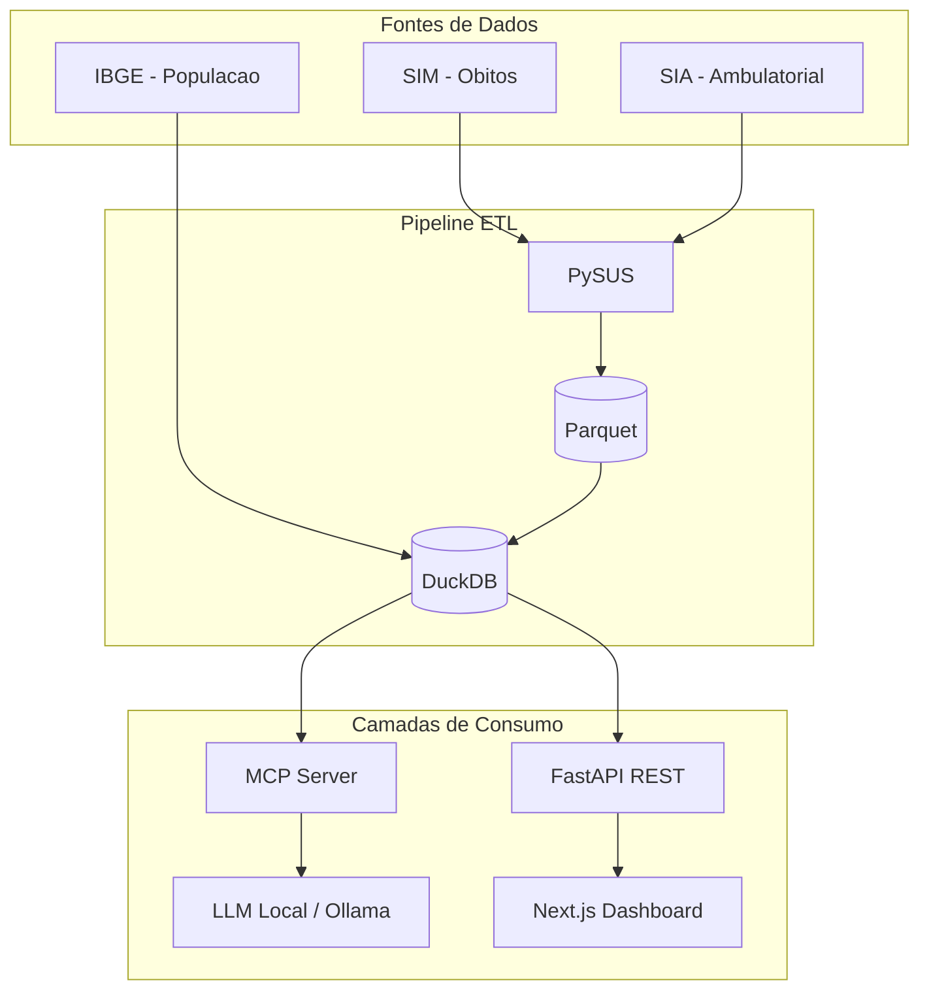
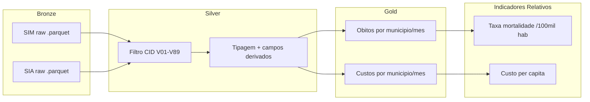
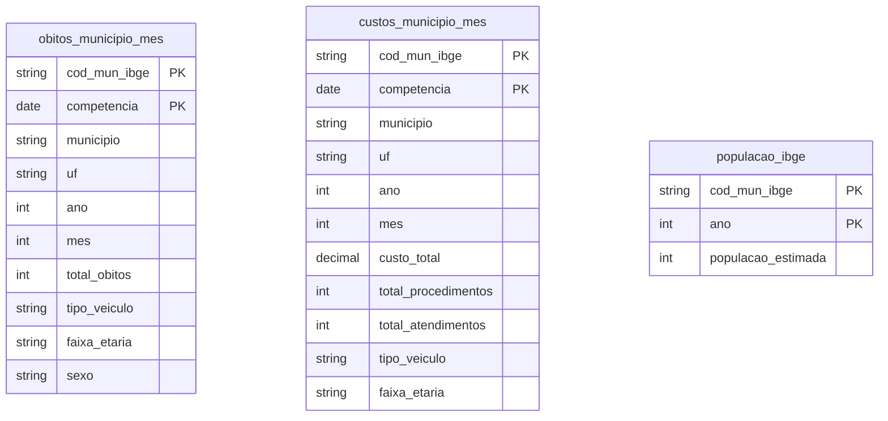
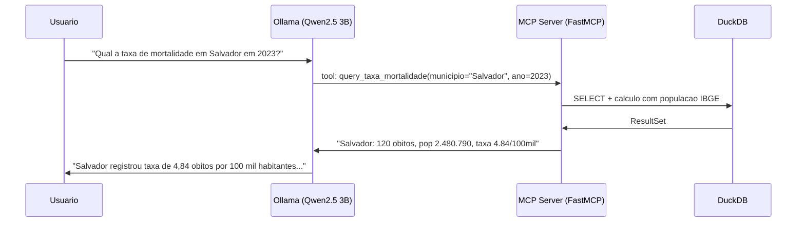

# Arquitetura — Pipeline Analitico de Acidentes de Transito no SUS

Visao geral, decisoes, fluxo de dados e referencias metodologicas do MVP.

## 1. Visao do Sistema

## 2. Fluxo de Dados (Medallion)

| Camada | Conteudo |
|--------|----------|
| Bronze | Dados brutos do SIM e SIA em Parquet |
| Silver | Filtrados (CID V01-V89), tipados, com campos derivados (tipo_veiculo, faixa_etaria) |
| Gold | Tabelas agregadas por municipio (IBGE) e competencia (mes/ano) |
| Indicadores | Taxas relativas usando populacao estimada do IBGE |

## 3. Componentes

### 3.1 Data Pipeline (`data-pipeline/`)

- **sample_data.py**: Gerador de dados amostrais com 9 municipios, distribuicoes realistas
- **bronze.py**: Ingestao bruta para Parquet
- **silver.py**: Filtragem CID + enriquecimento (tipo veiculo, faixa etaria, sexo)
- **gold.py**: Agregacoes por municipio/competencia
- **ibge.py**: Dados populacionais IBGE + calculo de taxas relativas
- **config.py**: Pydantic Settings (`.env`)
- **logging.py**: structlog (dev: console colorido, prod: JSON)

### 3.2 Backend (`backend/`)

- **FastAPI** com routers:
  - `/api/dashboard/*` - dados para graficos e mapa
  - `/api/indicadores/*` - taxas relativas com dados demograficos IBGE
- **DuckDB** in-process sobre Parquet Gold

### 3.3 MCP Server (`mcp-server/`)

- **FastMCP** com 5 tools:
  - `query_obitos` - consulta obitos com filtros
  - `query_custos` - consulta custos ambulatoriais
  - `query_taxa_mortalidade` - taxa por 100mil hab com populacao IBGE
  - `query_serie_temporal` - series mensais
  - `listar_municipios` - municipios disponiveis

### 3.4 Frontend (`frontend/`)

- **Next.js 16** + Tailwind CSS + Recharts
- **Leaflet** para mapas com circle markers proporcionais
- 3 paginas: Dashboard, Municipios, Mapa
- FilterBar reutilizavel e desacoplado

## 4. Modelo de Dados (Gold)

## 5. Indicadores Relativos

### 5.1 Taxa de Mortalidade por 100 mil habitantes

- **Formula**: `(obitos / populacao_estimada) * 100.000`
- **Referencia**: DATASUS - Ficha de Qualificacao C.12
- **URL**: http://tabnet.datasus.gov.br/cgi/idb2000/fqc12.htm
- **Justificativa**: Permite comparacao entre municipios de portes diferentes

### 5.2 Custo per capita

- **Formula**: `custo_total_sus / populacao_estimada`
- **Referencia**: Metodologia de contas em saude (OMS/RIPSA)
- **Justificativa**: Normaliza impacto financeiro pelo tamanho da populacao

### 5.3 Populacao Estimada

- **Fonte**: IBGE - Tabela 6579 SIDRA (Estimativas da Populacao Residente)
- **Metodologia**: Metodo matematico AiBi (projecoes por componentes demograficas)
- **Referencia**: 1o de julho de cada ano
- **URL**: https://sidra.ibge.gov.br/tabela/6579
- **API**: `https://apisidra.ibge.gov.br/values/t/6579/n6/{cod_ibge}/v/9324/p/{ano}`

## 6. MCP Server (Consulta em Linguagem Natural)

### Viabilidade para TCC de Baixo Custo

| Item | Opcao | Custo |
|------|-------|-------|
| LLM Local | Ollama + Qwen2.5 3B (Q4_K_M) | Gratuito |
| Requisitos | 4GB RAM, CPU moderno, ~2GB disco | Notebook pessoal |
| VPS MVP | Nautilus/Avira (4GB RAM) | R$ 40-80/mes |
| Stack completa | Python + DuckDB + Next.js | 100% open source |

**Ollama local**: Qwen2.5 3B roda em CPU a ~4.5 tokens/s com 3GB RAM. Ideal para demonstracao em notebook.

## 7. Tecnologias

| Camada | Tecnologia | Uso |
|--------|------------|-----|
| Extracao | PySUS | DATASUS, .dbc -> Parquet |
| Processamento | DuckDB | OLAP in-process, views Gold |
| Armazenamento | Parquet | Bronze/Silver/Gold (colunar) |
| Dados demograficos | IBGE API (Tabela 6579) | Populacao estimada |
| Backend | FastAPI + Pydantic Settings | API REST + config |
| IA | FastMCP + Ollama | MCP Server + LLM local |
| Frontend | Next.js 16, Tailwind, Recharts | Dashboards |
| Mapas | Leaflet | Circle markers, tooltips |
| Logging | structlog | JSON (prod) / console (dev) |
| Testes | pytest | Pipeline + API + integracao |
| Lint | ruff | PEP8 + imports + security |

## 8. Referencias Tecnicas

1. BRASIL. Ministerio da Saude. DATASUS. **Ficha de Qualificacao C.12 - Taxa de Mortalidade por Causas Externas**. Disponivel em: http://tabnet.datasus.gov.br/cgi/idb2000/fqc12.htm

2. IBGE. **Estimativas da Populacao Residente - Tabela 6579**. Sistema IBGE de Recuperacao Automatica (SIDRA). Disponivel em: https://sidra.ibge.gov.br/tabela/6579

3. IBGE. **Metodologia das Estimativas da Populacao Residente**. Metodo AiBi. Disponivel em: https://www.ibge.gov.br/estatisticas/sociais/populacao/9103-estimativas-de-populacao.html

4. MODEL CONTEXT PROTOCOL. **Introduction and Core Concepts**. Anthropic, 2024. Disponivel em: https://modelcontextprotocol.io

5. COELHO, Flavio Codecco et al. **PySUS: A library to open DATASUS files in Python**. GitHub, 2021. Disponivel em: https://github.com/AlertaDengue/PySUS

6. RAASCH, C. **DuckDB in Action**. Manning Publications, 2023.

7. OBSERVATORIO NACIONAL DE SEGURANCA VIARIA (ONSV). **Retrato da Seguranca Viaria no Brasil**. Campinas: ONSV, 2023.

8. OMS/RIPSA. **Indicadores e Dados Basicos para a Saude no Brasil (IDB)**. Rede Interagencial de Informacoes para a Saude.
