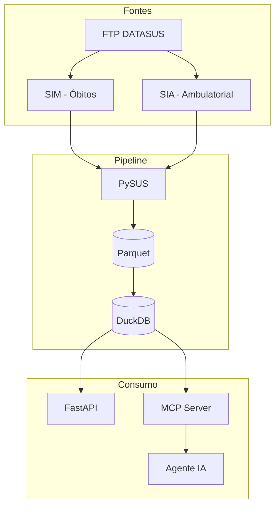
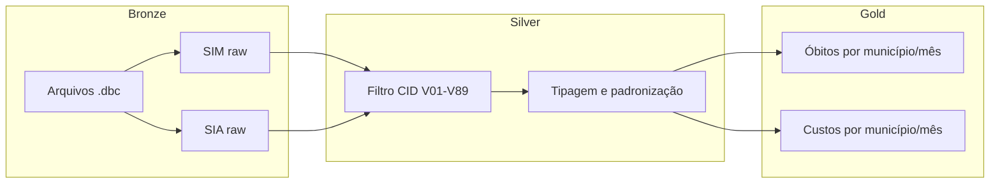
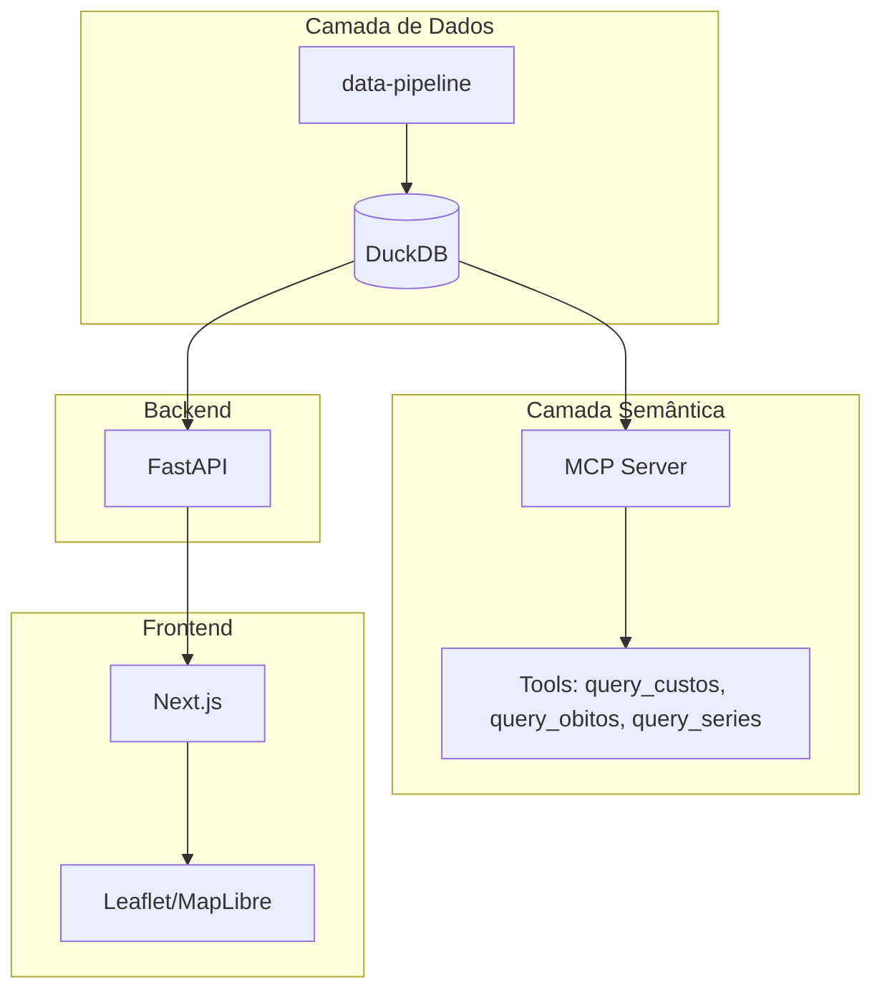
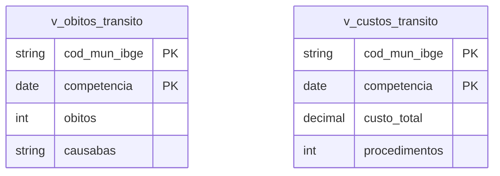
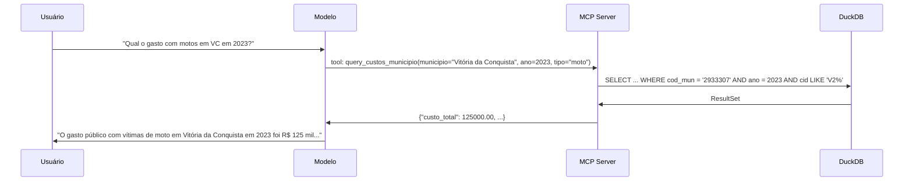
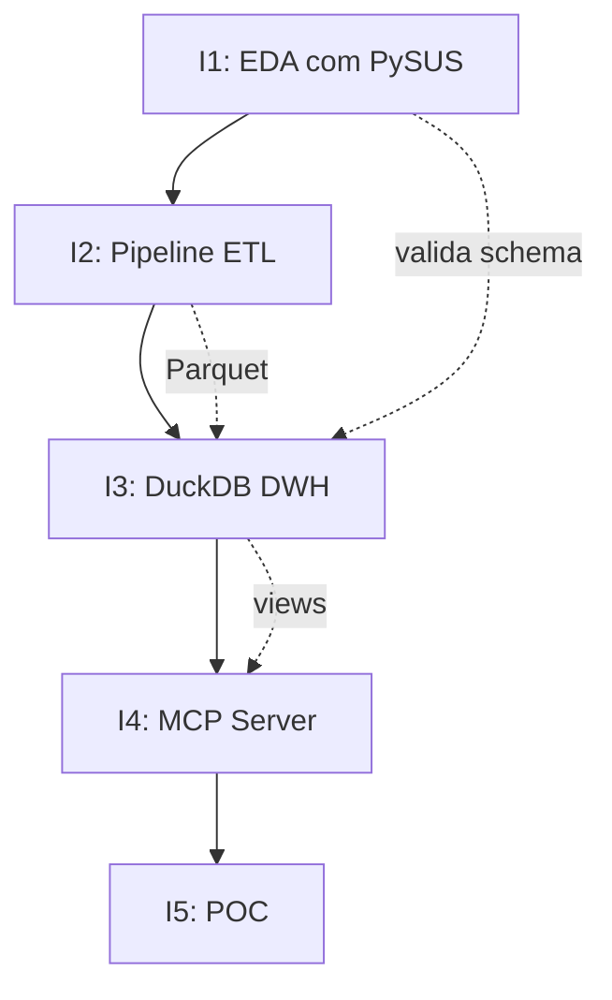

# Arquitetura — Pipeline Analítico de Acidentes de Trânsito no SUS

Visão geral, decisões e fluxo de dados do MVP.

## 1. Visão do Sistema

O sistema ingere dados brutos (.dbc) do SIM e SIA via PySUS, converte para Parquet, processa em DuckDB e expõe via FastAPI e servidor MCP.

## 2. Fluxo de Dados (Medallion)

| Camada | Conteúdo |
|--------|----------|
| Bronze | Arquivos .dbc baixados e convertidos para Parquet |
| Silver | Dados filtrados (CID V01–V89), tipados e padronizados |
| Gold | Tabelas/views agregadas por município (IBGE) e competência |

## 3. Componentes

### 3.1 Ingestão e Transformação

- **PySUS:** acesso ao FTP do DATASUS, leitura de .dbc e conversão.
- **Parquet:** armazenamento colunar, particionado por UF/ano.
- **DuckDB:** OLAP local, leitura nativa de Parquet, SQL para agregações.

### 3.2 Camada de Serviço

- **FastAPI:** API REST para dashboards e mapas.
- **MCP Server:** expõe tools que traduzem linguagem natural em SQL.

### 3.3 Camada de Apresentação

- **Next.js:** dashboards, gráficos e mapas coropléticos.
- **Leaflet/MapLibre:** visualização de GeoJSON por município.

## 4. Modelo de Dados (Gold)

Tabelas Gold unificadas por `cod_mun_ibge` (IBGE) e `competencia` (mês/ano).

## 5. Sequência MCP (Consulta em Linguagem Natural)

## 6. Iterações e Dependências

## 7. Tecnologias

| Camada | Tecnologia | Uso |
|--------|------------|-----|
| Extração | PySUS | DATASUS, .dbc → Parquet |
| Processamento | DuckDB | OLAP, views Gold |
| Armazenamento | Parquet | Bronze/Silver |
| Backend | FastAPI | API REST |
| IA | FastMCP | MCP + tools |
| Frontend | Next.js, Tailwind, shadcn/ui | Dashboards |
| Mapas | Leaflet / MapLibre | GeoJSON coroplético |
