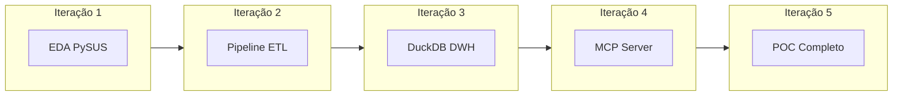

# Pipeline Analítico de Acidentes de Trânsito no SUS

MVP para TCC em Sistemas de Informação — Impacto Econômico e Macrotendências de Acidentes de Trânsito no SUS, com Engenharia de Dados (DuckDB) e IA via Model Context Protocol (MCP).

## Objetivo

Desenvolver um pipeline de processamento e servidor MCP para extração, análise temporal e quantificação do impacto econômico municipal dos acidentes de trânsito nas bases do DATASUS (SIM e SIA), permitindo interrogação via linguagem natural.

## Referência CID-10 — Acidentes de Trânsito

| Item | Valor |
|------|-------|
| Capítulo | XX (Causas Externas) |
| Códigos | **V01 a V89** (Acidentes de Transporte Terrestre) |
| Campos no DATASUS | `CAUSABAS` (SIM), `CIDPRI` (SIA/CIHA) |

Filtro SQL sugerido: `REGEXP_MATCHES(causabas, '^V[0-8][0-9]')` ou `LEFT(causabas, 3) BETWEEN 'V01' AND 'V89'`.

## Proposta de Implementação

### Stack

- **Extração:** PySUS (Python)
- **Processamento:** DuckDB, Parquet
- **Interface IA:** FastMCP (MCP)
- **Backend:** FastAPI
- **Frontend:** Next.js, Tailwind, shadcn/ui

### Estrutura do Monorepo

```
/data-pipeline    # ETL com PySUS → Parquet
/notebooks        # EDA e validação
/backend          # FastAPI + DuckDB
/frontend         # Next.js dashboards
/mcp-server       # FastMCP + tools SQL
```

Detalhes: [ARCHITECTURE.md](./ARCHITECTURE.md)

---

## Plano de Iterações



| Iteração | Escopo | Entregas |
|----------|--------|----------|
| **1** | Análise Exploratória | Notebook com PySUS: download SIM/SIA, conversão DBC→Parquet, filtro CID V01–V89, agregados por município/mês |
| **2** | Pipeline ETL | Scripts em `data-pipeline/` automatizando extração e particionamento |
| **3** | Data Warehouse | DuckDB com views: custos e óbitos por município/competência |
| **4** | Servidor MCP | FastMCP com tools que traduzem NL → SQL no DuckDB |
| **5** | POC | Integração ETL + MCP + interface mínima (API ou chat) |

---

## Instruções para Execução por IA

Este repositório está conectado ao Cursor para implementação iterativa. Ao executar iterações, siga:

### Iteração 1 — Análise Exploratória

1. Criar `notebooks/01_eda_transito_sus.ipynb`.
2. Usar **PySUS** conforme API oficial:
   - `from pysus import SIM, SIA`
   - SIM: `sim = SIM().load()` → `sim.get_files("CID10", uf=["BA","SP","MG"], year=[2022,2023])` → `sim.download(file)` (retorna .parquet)
   - SIA: `sia = SIA().load()` → `sia.get_files("PA", uf="BA", year=2023, month=[1,2,3])` → `sia.download(files)` (PA = Produção Ambulatorial)
3. Ler Parquet com `parquet.to_dataframe()` ou `duckdb.read_parquet()`.
4. Filtrar: SIM `CAUSABAS` e SIA `PA_CIDPRI` em V01–V89 (`REGEXP_MATCHES` ou `LEFT(col, 3) BETWEEN 'V01' AND 'V89'`).
5. Agregar por município (SIM: `CODMUNOCOR`/`CODMUNRES`; SIA: `PA_UFMUN`/`PA_MUNAT`) e competência (SIM: `DTOBITO`; SIA: `PA_DATREF`).
6. Documentar schema, volumes e exemplos de consulta SQL.

### Iteração 2 — Pipeline ETL

1. Criar `data-pipeline/` com módulos reutilizáveis.
2. Parametrizar: UF, anos, bases (SIM, SIA).
3. Output: Parquet particionado em `data/raw/` ou `data/bronze/`.

### Iteração 3 — DuckDB

1. Criar `data/` ou `backend/` com DuckDB.
2. Views: `v_custos_transito_municipio_mes`, `v_obitos_transito_municipio_mes`.
3. Unificar SIM e SIA por código IBGE e competência.

### Iteração 4 — MCP Server

1. Criar `mcp-server/` com FastMCP.
2. Tools: `query_custos_municipio`, `query_obitos_municipio`, `query_series_temporal`.
3. Gerar SQL parametrizado e executar no DuckDB.

### Iteração 5 — POC

1. Integrar ETL + DuckDB + MCP.
2. Testar fluxo end-to-end e respostas em linguagem natural.

### Regras Técnicas

- Python 3.10+; preferir `uv` para ambiente.
- Dados: SIM (óbitos) e SIA (produção ambulatorial/custos).
- Municípios prioritários: São Paulo, Belo Horizonte, Vitória da Conquista (BA).
- Manter arquivos Parquet em `data/` (adicionar ao `.gitignore` se >50MB).
