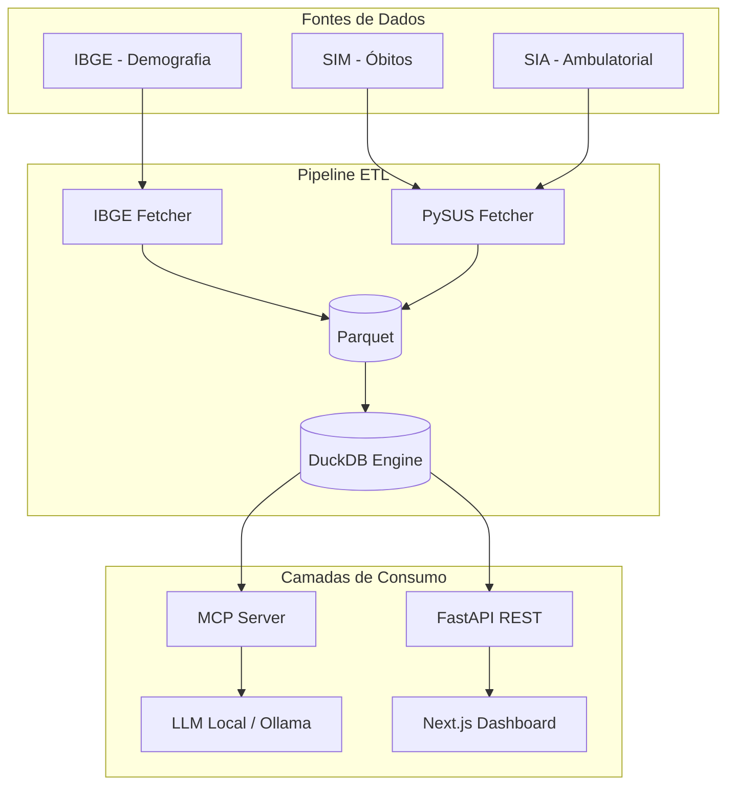
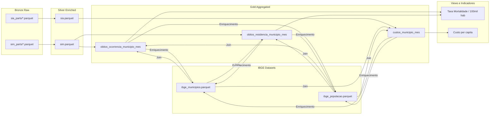
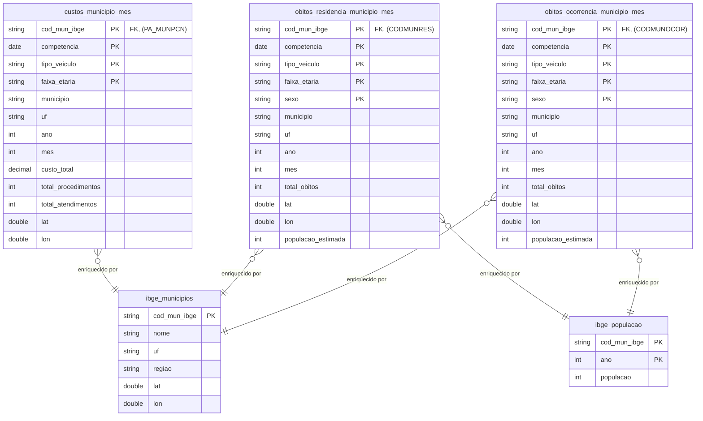

# Arquitetura — Pipeline Analítico de Acidentes de Trânsito no SUS

Visão geral, decisões, fluxo de dados e referências metodológicas do MVP.

## 1. Visão do Sistema

## 2. Fluxo de Dados (Arquitetura Medallion)

A arquitetura de dados segue o padrão Medallion, garantindo qualidade e rastreabilidade progressivas.

| Camada | Conteúdo | Propósito |
|---|---|---|
| **Bronze** | Dados brutos do SIM e SIA em Parquet, particionados por UF e ano. | Cópia fiel da fonte, otimizada para acesso rápido. |
| **Silver** | Dados filtrados (CID V01-V89), com tipos corrigidos e campos derivados (tipo_veiculo, faixa_etaria, sexo_desc). | Base limpa e padronizada para análise. |
| **IBGE** | Parquets gerados por `ibge_fetcher`: localidades, malhas, população. | Fonte de dados demográficos para enriquecimento. |
| **Gold** | Tabelas agregadas por município/competência, separadas por conceito. | Views de negócio pré-calculadas para consumo rápido pela API. |

## 3. Modelo de Dados (Camada Gold)

A camada Gold foi refatorada para separar explicitamente os fatos por dimensão de localidade, resolvendo ambiguidades analíticas.

**Principais Mudanças:**

- **Desambiguação de Óbitos**: A tabela `obitos_municipio_mes` foi dividida em `obitos_ocorrencia_municipio_mes` e `obitos_residencia_municipio_mes`.
- **Chaves Primárias**: As chaves primárias foram expandidas para incluir as dimensões de análise (`tipo_veiculo`, `faixa_etaria`, `sexo`) para refletir a granularidade real das tabelas.
- **Clareza Semântica**: O modelo de dados agora reflete explicitamente a diferença entre o local **onde o óbito ocorreu** e onde a **vítima residia**, permitindo análises mais precisas.

## 4. Componentes e Tecnologias

A stack tecnológica permanece a mesma, mas a lógica interna dos componentes foi aprimorada.

| Camada | Tecnologia | Uso |
|---|---|---|
| Extração | PySUS | DATASUS, .dbc -> Parquet |
| Processamento | DuckDB | OLAP in-process, agregação para a camada Gold |
| Armazenamento | Parquet | Bronze/Silver/Gold (colunar) |
| Dados demográficos| IBGE API (SIDRA, etc.) | População, coordenadas, malhas |
| Backend | FastAPI + Pydantic | API REST para servir os dados da camada Gold |
| IA Preditiva | TimesFM | Previsão de séries temporais |
| IA Conversacional| FastMCP + Ollama | Servidor de contexto para consultas em linguagem natural |
| Frontend | Next.js, Tailwind, Recharts, MapLibre GL JS | Dashboards e visualizações |
| Testes | pytest | Testes unitários e de integração para pipeline e API |
| Qualidade | ruff | Linting e formatação de código |

---

## 5. Indicadores Relativos e Dimensões de Análise

### 5.1. Taxa de Mortalidade por 100 mil habitantes

- **Fórmula**: `(total_de_obitos / populacao_estimada) * 100.000`
- **Contexto**: Pode ser calculada tanto por **ocorrência** quanto por **residência**, dependendo da tabela Gold utilizada.
- **Padrão do Sistema**: Por padrão, o sistema deve exibir a taxa por **ocorrência**, que reflete o risco do local, mas deve permitir ao usuário alternar para a visão por **residência**.

### 5.2. Custo per capita

- **Fórmula**: `custo_total_sus / populacao_estimada`
- **Contexto**: A base SIA/PA atribui o custo ao **município de residência do paciente** (`PA_MUNPCN`). Portanto, este indicador reflete o ônus financeiro para o município de origem do paciente, não necessariamente onde o atendimento ocorreu.

### 5.3. Dimensões Geográficas

O sistema suportará filtros em três níveis de granularidade geográfica:

1.  **Município**: Filtro por município de ocorrência (padrão) ou residência.
2.  **UF (Estado)**: Filtro por Unidade da Federação.
3.  **Região**: Uma abstração que agrupa UFs (Norte, Nordeste, Sudeste, Sul, Centro-Oeste).

---

## 6. Referências Técnicas

As referências técnicas e metodológicas permanecem as mesmas listadas na versão anterior do documento e no pré-projeto de pesquisa.
