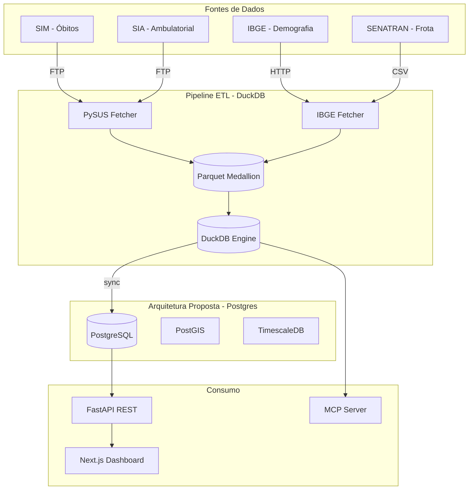
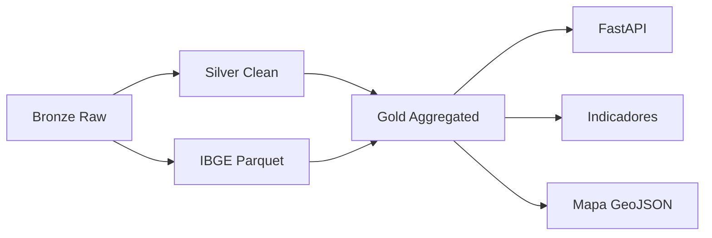

# Arquitetura — Pipeline Analítico de Acidentes de Trânsito no SUS

> Atualizado em: 2026-05-09 | Versão: 2.0

## 1. Visão do Sistema



---

## 2. Status de Implementação

| Fonte | Status | Observações |
|-------|--------|-------------|
| SIM (óbitos) | ✅ Implementada | ~38k registros (BA+PB) |
| SIA (custos) | ⚠️ Opcional | Desabilitado para otimização ETL |
| IBGE (coords/pop) | ⚠️ Parcial | Job segregado (`--ibge`) e deduplicação por município/ano |
| SENATRAN (frota) | ⏳ Pendente | Para indicador ób./10k veículos |
| PRF | ⏳ Pendente | Cruzamento com SIM |
| RENAEST | ⏳ Pendente | Validação ocorrências |

---

## 3. Arquitetura Atual (DuckDB-only)

### Fluxo Medallion



### Camadas Implementadas

| Camada | Conteúdo | Status |
|--------|-----------|--------|
| **Bronze** | `bronze/sim/*.parquet`, `bronze/sia/*.parquet` | ✅ |
| **Silver** | `silver/sim.parquet` (CID V01-V89) | ✅ |
| **IBGE** | `ibge_municipios.parquet`, `ibge_populacao.parquet` | ⚠️ lat/lon null |
| **Gold** | `obitos_ocorrencia_mes`, `obitos_residencia_mes`, `custos_mes`, `eventos_diarios` | ✅ |
| **API** | 7 endpoints (dashboard, geo, indicadores) | ✅ |
| **Frontend** | 5 páginas (dashboard, mapa, ranking, município, chat) | ✅ |

### Segregação de Responsabilidades (Implementada)

- **Pipeline SUS (`--sim-only` / `--real`)**: processa somente dados SIM/SIA (bronze/silver/gold).
- **Pipeline de Enriquecimento (`--ibge`)**: executa fetchers externos (IBGE/SIDRA/malhas) de forma independente.
- **Contrato de integração**: enriquecimento persiste artefatos em `data/ibge_*.parquet` consumidos pela camada Gold sem dependência de HTTP em tempo de execução do SUS.

---

## 4. Arquitetura Proposta (Postgres + PostGIS)

### Por que evoluir?

| Aspecto | DuckDB | Postgres + PostGIS |
|---------|--------|-------------------|
| Dados geoespaciais | Limpo (GDAL) | Nativo PostGIS, index R-Tree |
| Concorrência | Single-writer | MVCC, connection pooling |
| Extensões | Limitado | PostGIS, TimescaleDB, pgvector |
| API REST | FastAPI manual | PostgREST auto-generated |
| Particionamento | Por arquivo | Native table partitioning |

### Extensões Propostas

```sql
CREATE EXTENSION postgis;           -- GIS nativo
CREATE EXTENSION timescaledb;        -- Séries temporais
CREATE EXTENSION pg_partman;         -- Partições automáticas
CREATE EXTENSION pgvector;           -- Embeddings (futuro)
```

### Estratégia de Migração Gradual

```
Fase 1: DuckDB (ETL) + Postgres (serving) [dual-engine]
Fase 2: Postgres substitui DuckDB gradualmente
Fase 3: Parquet como backup/archive
```

---

## 5. Fontes de Dados Detalhadas

### 5.1 SIM (Sistema de Informações sobre Mortalidade)

| Campo | Descrição | Status |
|-------|-----------|--------|
| CODMUNOCOR | Município ocorrência (7d) | ✅ |
| CODMUNRES | Município residência (7d) | ✅ |
| CAUSABAS | CID-10 (V01-V89) | ✅ |
| DTOBITO | Data óbito | ✅ |
| SEXO | 1=M, 2=F | ✅ |
| IDADE | Codificada 3 dígitos | ✅ |

### 5.2 SENATRAN (Frota de Veículos)

| Campo | Descrição | Status |
|-------|-----------|--------|
| UF | Sigla estado | ✅ em CSV |
| MUNICIPIO | Nome município | ⚠️ precisa fuzzy match |
| AUTOMOVEL, MOTOCICLETA, etc. | Por tipo | ⏳ pendente |
| cod_ibge | Código 7 dígitos | ⏳ pendente (fuzzy) |

**Indicador planejado**: `(óbitos * 10.000) / frota_municipio`

---

## 6. Componentes e Tecnologias

| Camada | Tecnologia Atual | Tecnologia Proposta |
|--------|-----------------|---------------------|
| ETL Engine | DuckDB | DuckDB (ETL) + Postgres (serving) |
| Armazenamento | Parquet | Parquet + PostgreSQL |
| GIS | GeoJSON externo | PostGIS |
| Séries Temporais | Parquet diário | TimescaleDB hypertable |
| Backend | FastAPI | FastAPI + PostgREST |
| Frontend | Next.js 16 | Next.js 16 |

---

## 7. Endpoints API

| Endpoint | Filtros | Status |
|----------|---------|--------|
| `GET /api/dashboard/summary` | ano, municipio, uf, regiao, tipo_veiculo, dimensao | ✅ |
| `GET /api/dashboard/municipios` | uf, regiao, dimensao | ✅ |
| `GET /api/dashboard/municipio/{cod}` | ano, dimensao | ✅ |
| `GET /api/dashboard/mapa` | ano, uf, regiao, dimensao, metrica | ✅ |
| `GET /api/geo/municipios` | ano, uf, regiao, dimensao, metrica | ✅ |
| `GET /api/indicadores/municipio/{cod}` | ano | ✅ |
| `GET /api/indicadores/ranking` | ano, metrica, uf, regiao | ✅ |

---

## 8. ADR (Arquitetura Decision Records)

| ADR | Título | Status |
|-----|--------|--------|
| ADR-001 | DuckDB vs Postgres como engine analítica | 🔄 Pendente |

Ver [`adr/ADR-001_ENGINE_CHOICE.md`](adr/ADR-001_ENGINE_CHOICE.md)

---

## 9. Referências

- [`SPEC.md`](SPEC.md) — Visão geral e status
- [`MODELAGEM_DADOS.md`](MODELAGEM_DADOS.md) — Schema completo
- [`PIPELINE_ETL.md`](PIPELINE_ETL.md) — Otimização do pipeline

---

*Última atualização: 2026-05-09*