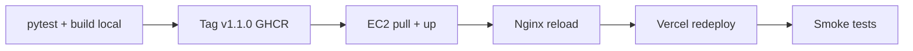

# Plano de atualização — Backend (EC2) e Frontend (Vercel)

> Rollout das correções de segurança (tag **v1.1.0** / `IMAGE_TAG=1.1.0`).
> Tempo estimado: **30–45 min** com dados Gold já na VPS.

---

## Pré-requisitos

- [ ] Tag Git `v1.1.0` publicada (CI build GHCR)
- [ ] Acesso SSH à EC2
- [ ] Acesso ao dashboard Vercel do projeto
- [ ] Backup do `.env.prod` atual na VPS

---

## Fase 1 — Backend (EC2 + DuckDNS)

### 1.1 Atualizar código e imagens

```bash
ssh ubuntu@SEU_IP_EC2
cd ~/tcc-pipeline-transito-sus   # ou diretório de deploy

# Backup
cp .env.prod .env.prod.bak.$(date +%Y%m%d)

# Atualizar .env.prod (copie de .env.prod.example se necessário)
nano .env.prod
```

Conteúdo mínimo do `.env.prod`:

```bash
IMAGE_TAG=1.1.0
API_URL=https://api.tccsinistros.duckdns.org
CORS_ORIGINS=https://tcc-pipeline-transito-sus.vercel.app
WEB_PORT=3000
LOG_LEVEL=INFO
MCP_BRIDGE_ENABLED=false
PREDICT_ENABLED=false
RATE_LIMIT_RPM=60
```

```bash
docker login ghcr.io
docker compose -f docker-compose.prod.yml --env-file .env.prod pull
docker compose -f docker-compose.prod.yml --env-file .env.prod up -d
docker compose -f docker-compose.prod.yml ps
curl -s http://127.0.0.1:8000/ | jq .
```

Verificar resposta do health:

```json
{
  "security": { "mcp_bridge": false, "predict": false }
}
```

### 1.2 Nginx (primeira vez ou atualização)

```bash
sudo cp deploy/nginx/tccsinistros.conf.example /etc/nginx/sites-available/tccsinistros
sudo ln -sf /etc/nginx/sites-available/tccsinistros /etc/nginx/sites-enabled/
sudo nginx -t && sudo systemctl reload nginx
```

Certificado (se ainda não existir):

```bash
sudo certbot --nginx -d api.tccsinistros.duckdns.org
```

### 1.3 Firewall

```bash
sudo ufw status
# Deve permitir apenas: 22, 80, 443
sudo ufw allow 22/tcp
sudo ufw allow 80/tcp
sudo ufw allow 443/tcp
sudo ufw enable
```

**AWS Security Group:** mesma regra — bloquear 8000, 3000, 5433 publicamente.

### 1.4 Smoke tests (API pública)

```bash
# Health + headers
curl -sI https://api.tccsinistros.duckdns.org/

# CORS com origem Vercel
curl -sI -H "Origin: https://tcc-pipeline-transito-sus.vercel.app" \
  https://api.tccsinistros.duckdns.org/api/sim/summary

# MCP desligado
curl -s -o /dev/null -w "%{http_code}" \
  https://api.tccsinistros.duckdns.org/api/mcp/query_obitos
# Esperado: 404

# Predict desligado
curl -s -o /dev/null -w "%{http_code}" \
  https://api.tccsinistros.duckdns.org/api/predict/obitos/293330
# Esperado: 404

# Injection bloqueado
curl -s -o /dev/null -w "%{http_code}" \
  "https://api.tccsinistros.duckdns.org/api/dashboard/municipio/29333'%20OR%201=1--"
# Esperado: 422
```

---

## Fase 2 — Frontend (Vercel)

> O frontend **não embute** URL da API no build; a API é injetada em runtime.
> Para deploy Vercel-only (sem container web na EC2), só a API roda na EC2.

### 2.1 Variáveis de ambiente Vercel

| Variável | Valor | Ambiente |
|----------|-------|----------|
| `API_URL` | `https://api.tccsinistros.duckdns.org` | Production |

(Não é necessário `NEXT_PUBLIC_API_URL` em produção — use `/runtime-config`.)

### 2.2 Deploy

```bash
# Local (push dispara Vercel automaticamente se CI conectado)
git push origin main

# Ou redeploy manual no dashboard Vercel → Deployments → Redeploy
```

### 2.3 Verificação pós-deploy

1. Abrir DevTools → Network → carregar `/runtime-config` → confirmar `window.__API_URL__`
2. Dashboard carrega KPIs (sem erro CORS)
3. `/preliminares?ano=2025` → sidebar → `/dashboard` corrige ano
4. Response headers incluem `X-Frame-Options: DENY`

---

## Fase 3 — Rollback (se necessário)

```bash
# EC2
IMAGE_TAG=1.0.0 docker compose -f docker-compose.prod.yml --env-file .env.prod up -d

# Vercel: redeploy do deployment anterior no dashboard
```

---

## Checklist final

- [ ] `security.mcp_bridge === false` no health da API
- [ ] `security.predict === false` no health da API
- [ ] CORS responde com origem Vercel (não `*`)
- [ ] Portas 8000/3000 **não** acessíveis da internet (só 443)
- [ ] Dashboard Vercel funcional com filtros e mapa
- [ ] `uv run pytest tests/test_security.py -v` passou antes do deploy

---

## Ordem recomendada



---

*Ver também: [SECURITY.md](SECURITY.md), [DEPLOY_VPS.md](DEPLOY_VPS.md)*
