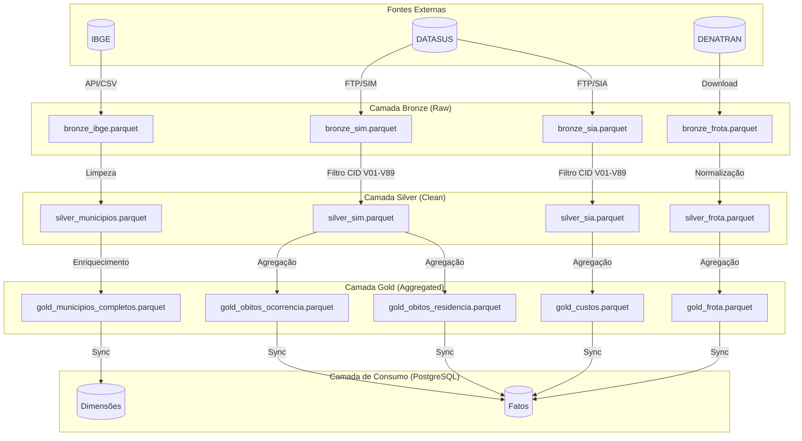
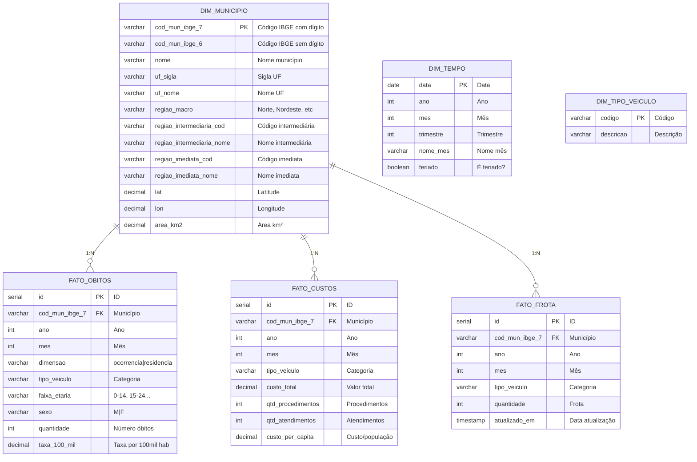

# Modelagem de Dados - Pipeline Analítico de Acidentes de Trânsito no SUS

Este documento descreve a modelagem de dados completa do projeto, desde a camada Bronze (ingestão) até a camada de consumo (PostgreSQL), seguindo a arquitetura medallion e modelo dimensional.

## Sumário

1. [Visão Geral da Arquitetura](#1-visão-geral-da-arquitetura)
2. [Camada Bronze (Raw)](#2-camada-bronze-raw)
3. [Camada Silver (Clean)](#3-camada-silver-clean)
4. [Camada Gold (Aggregated)](#4-camada-gold-aggregated)
5. [Camada de Consumo (PostgreSQL)](#5-camada-de-consumo-postgresql)
6. [Fontes de Dados](#6-fontes-de-dados)
7. [Dicionário de Dados](#7-dicionário-de-dados)

---

## 1. Visão Geral da Arquitetura



---

## 2. Camada Bronze (Raw)

Dados brutos como chegam das fontes, sem transformações significativas.

### 2.1 bronze_sim.parquet

Óbitos do Sistema de Informações sobre Mortalidade (SIM) - DATASUS.

| Campo | Tipo | Descrição | Exemplo |
|-------|------|-----------|---------|
| `NUMERODO` | STRING | Número do óbito (controle) | "12345" |
| `CODMUNOCOR` | STRING | Código IBGE município ocorrência | "2933307" |
| `CODMUNRES` | STRING | Código IBGE município residência | "2933307" |
| `DTOBITO` | STRING | Data óbito (DDMMYYYY) | "15052023" |
| `CAUSABAS` | STRING | Causa básica (CID-10) | "V892" |
| `IDADE` | STRING | Idade codificada (3 dígitos) | "498" |
| `SEXO` | STRING | Sexo (1=M, 2=F) | "1" |
| `RACACOR` | STRING | Raça/cor | "1" |
| `ESTCIV` | STRING | Estado civil | "1" |
| `ESC` | STRING | Escolaridade | "2" |
| `OCUP` | STRING | Ocupação | "XXXX" |
| `LOCOCOR` | STRING | Local ocorrência | "1" |
| `ASSISTMED` | STRING | Assistência médica | "1" |
| `UF` | STRING | Sigla UF | "BA" |

**Fonte**: DATASUS - Sistema de Informações sobre Mortalidade (SIM)  
**Periodicidade**: Mensal/Anual  
**Extração**: PySUS / FTP

### 2.2 bronze_sia.parquet

Produção Ambulatorial do Sistema de Informações Ambulatoriais (SIA) - DATASUS.

| Campo | Tipo | Descrição | Exemplo |
|-------|------|-----------|---------|
| `PA_CMP` | STRING | Competência (YYYYMM) | "202301" |
| `PA_MUNPCN` | STRING | Município paciente | "2933307" |
| `PA_CIDPRI` | STRING | CID primário | "V892" |
| `PA_VALAPR` | STRING | Valor aprovado (com espaços) | "     1500.00" |
| `PA_QTDAPR` | STRING | Quantidade aprovada | "1" |
| `PA_IDADE` | STRING | Idade paciente | "035" |
| `PA_FLIDADE` | STRING | Flag idade (1=anos, 2=meses, 3=dias) | "1" |
| `PA_SEXO` | STRING | Sexo (M/F) | "M" |
| `PA_RACACOR` | STRING | Raça/cor | "01" |
| `UF` | STRING | Sigla UF | "BA" |

**Fonte**: DATASUS - SIA/PA  
**Periodicidade**: Mensal  
**Extração**: PySUS / FTP

### 2.3 bronze_ibge.parquet

Dados brutos do IBGE (CSV + API Localidades).

| Campo | Tipo | Descrição | Exemplo |
|-------|------|-----------|---------|
| `UF` | STRING | Código UF | "29" |
| `Nome_UF` | STRING | Nome estado | "Bahia" |
| `Região Geográfica Intermediária` | STRING | Código | "2901" |
| `Nome Região Geográfica Intermediária` | STRING | Nome | "Salvador" |
| `Região Geográfica Imediata` | STRING | Código | "29001" |
| `Nome Região Geográfica Imediata` | STRING | Nome | "Vitória da Conquista" |
| `Município` | STRING | Código 6 dígitos | "93307" |
| `Código Município Completo` | STRING | Código 7 dígitos | "2933307" |
| `Nome_Município` | STRING | Nome | "Vitória da Conquista" |
| `latitude` | DOUBLE | Latitude (API) | "-14.8616" |
| `longitude` | DOUBLE | Longitude (API) | "-40.8443" |

**Fonte**: IBGE - Códigos dos Municípios + API Localidades  
**Periodicidade**: Anual (atualização cadastral)  
**Extração**: CSV + HTTP API

### 2.4 bronze_frota.parquet

Dados brutos de frota de veículos do DENATRAN.

| Campo | Tipo | Descrição | Exemplo |
|-------|------|-----------|---------|
| `uf` | STRING | Sigla UF | "BA" |
| `municipio` | STRING | Nome município | "VITORIA DA CONQUISTA" |
| `cod_municipio` | STRING | Código IBGE | "2933307" |
| `tipo_veiculo` | STRING | Tipo veículo | "AUTOMOVEL" |
| `quantidade` | INTEGER | Quantidade | "15000" |
| `mes_referencia` | INTEGER | Mês | "6" |
| `ano_referencia` | INTEGER | Ano | "2023" |

**Fonte**: DENATRAN - RENAVAM  
**Periodicidade**: Mensal  
**Extração**: Download CSV

---

## 3. Camada Silver (Clean)

Dados limpos, padronizados e filtrados.

### 3.1 silver_sim.parquet

| Campo | Tipo | Descrição | Transformação |
|-------|------|-----------|---------------|
| `causabas` | STRING | CID-10 | TRIM, uppercase |
| `cid_grupo` | STRING | Grupo CID (3 chars) | LEFT(causabas, 3) |
| `dt_obito` | DATE | Data do óbito | STRPTIME(DTOBITO, '%d%m%Y') |
| `competencia` | DATE | Primeiro dia do mês | DATE_TRUNC('month', dt_obito) |
| `cod_mun_ocorrencia` | STRING | Código IBGE 7 dígitos | TRIM(CODMUNOCOR) |
| `cod_mun_residencia` | STRING | Código IBGE 7 dígitos | TRIM(CODMUNRES) |
| `sexo` | INTEGER | Sexo (1=M, 2=F) | CAST(TRIM(SEXO) AS INT) |
| `idade` | INTEGER | Idade em anos | DECODE_IDADE_SIM(IDADE) |
| `uf` | STRING | Sigla UF | TRIM(UF) |
| `tipo_veiculo` | STRING | Categoria veículo | CASE LEFT(cid_grupo)... |
| `sexo_desc` | STRING | Descrição sexo | CASE sexo... |
| `faixa_etaria` | STRING | Faixa etária | CASE idade... |

**Filtro aplicado**: `cid_grupo BETWEEN 'V01' AND 'V89'`

### 3.2 silver_sia.parquet

| Campo | Tipo | Descrição | Transformação |
|-------|------|-----------|---------------|
| `cid_primario` | STRING | CID-10 | TRIM(PA_CIDPRI) |
| `cid_grupo` | STRING | Grupo CID | LEFT(cid_primario, 3) |
| `cod_mun` | STRING | Código IBGE | TRIM(PA_MUNPCN) |
| `datref` | STRING | Competência raw | TRIM(PA_CMP) |
| `competencia` | DATE | Data competência | MAKE_DATE(YYYY, MM, 1) |
| `valor_aprovado` | DECIMAL(15,2) | Valor R$ | CAST(TRIM(PA_VALAPR)) |
| `qtd_aprovada` | INTEGER | Quantidade | CAST(TRIM(PA_QTDAPR)) |
| `sexo` | STRING | Sexo | TRIM(PA_SEXO) |
| `idade` | INTEGER | Idade anos | DECODE_IDADE_SIA(PA_IDADE, PA_FLIDADE) |
| `uf` | STRING | Sigla UF | TRIM(UF) |
| `tipo_veiculo` | STRING | Categoria | CASE LEFT(cid_grupo)... |
| `faixa_etaria` | STRING | Faixa etária | CASE idade... |

**Filtro aplicado**: `cid_grupo BETWEEN 'V01' AND 'V89'`

### 3.3 silver_municipios.parquet

| Campo | Tipo | Descrição |
|-------|------|-----------|
| `cod_mun_ibge_7` | STRING | Código IBGE com dígito |
| `cod_mun_ibge_6` | STRING | Código IBGE sem dígito |
| `nome` | STRING | Nome município |
| `uf_sigla` | STRING | Sigla UF |
| `uf_nome` | STRING | Nome UF |
| `regiao_macro` | STRING | Região Brasil |
| `regiao_intermediaria_cod` | STRING | Código região intermediária IBGE 2017 |
| `regiao_intermediaria_nome` | STRING | Nome região intermediária |
| `regiao_imediata_cod` | STRING | Código região imediata IBGE 2017 |
| `regiao_imediata_nome` | STRING | Nome região imediata |
| `lat` | DOUBLE | Latitude |
| `lon` | DOUBLE | Longitude |
| `area_km2` | DOUBLE | Área territorial km² (Censo 2022) |

### 3.4 silver_frota.parquet

| Campo | Tipo | Descrição |
|-------|------|-----------|
| `cod_mun_ibge` | STRING | Código IBGE |
| `ano` | INTEGER | Ano referência |
| `mes` | INTEGER | Mês referência |
| `tipo_veiculo` | STRING | Categoria padronizada |
| `quantidade` | INTEGER | Frota |
| `uf` | STRING | Sigla UF |

---

## 4. Camada Gold (Aggregated)

Dados agregados prontos para consumo.

### 4.1 gold_obitos_ocorrencia.parquet

Agregação por município/mês de **OCORRÊNCIA**.

| Campo | Tipo | Descrição |
|-------|------|-----------|
| `cod_mun_ibge` | STRING | Código município |
| `municipio` | STRING | Nome município |
| `uf` | STRING | Sigla UF |
| `competencia` | DATE | Primeiro dia do mês |
| `ano` | INTEGER | Ano |
| `mes` | INTEGER | Mês |
| `total_obitos` | INTEGER | Quantidade de óbitos |
| `tipo_veiculo` | STRING | Categoria |
| `faixa_etaria` | STRING | Faixa etária |
| `sexo` | STRING | Sexo |
| `lat` | DOUBLE | Latitude |
| `lon` | DOUBLE | Longitude |
| `populacao_estimada` | INTEGER | População IBGE |
| `dimensao` | STRING | Valor fixo: 'ocorrencia' |

### 4.2 gold_obitos_residencia.parquet

Agregação por município/mês de **RESIDÊNCIA**.

Mesmo schema de `gold_obitos_ocorrencia`, com `dimensao = 'residencia'`.

### 4.3 gold_custos.parquet

Agregação de custos SIA por município/mês.

| Campo | Tipo | Descrição |
|-------|------|-----------|
| `cod_mun_ibge` | STRING | Código município |
| `municipio` | STRING | Nome município |
| `uf` | STRING | Sigla UF |
| `competencia` | DATE | Primeiro dia do mês |
| `ano` | INTEGER | Ano |
| `mes` | INTEGER | Mês |
| `custo_total` | DECIMAL(15,2) | Soma PA_VALAPR |
| `total_procedimentos` | INTEGER | Soma PA_QTDAPR |
| `total_atendimentos` | INTEGER | COUNT(*) |
| `tipo_veiculo` | STRING | Categoria |
| `faixa_etaria` | STRING | Faixa etária |
| `lat` | DOUBLE | Latitude |
| `lon` | DOUBLE | Longitude |

### 4.4 gold_frota.parquet

Agregação de frota por município/ano.

| Campo | Tipo | Descrição |
|-------|------|-----------|
| `cod_mun_ibge` | STRING | Código município |
| `ano` | INTEGER | Ano |
| `tipo_veiculo` | STRING | Categoria |
| `quantidade` | INTEGER | Frota média anual |
| `uf` | STRING | Sigla UF |

### 4.5 gold_municipios_completos.parquet

Dimensão geográfica enriquecida.

| Campo | Tipo | Descrição |
|-------|------|-----------|
| `cod_mun_ibge_7` | STRING | Código IBGE |
| `cod_mun_ibge_6` | STRING | Código sem dígito |
| `nome` | STRING | Nome município |
| `uf_sigla` | STRING | Sigla UF |
| `uf_nome` | STRING | Nome UF |
| `regiao_macro` | STRING | Região Brasil |
| `regiao_intermediaria_cod` | STRING | Código região intermediária |
| `regiao_intermediaria_nome` | STRING | Nome região intermediária |
| `regiao_imediata_cod` | STRING | Código região imediata |
| `regiao_imediata_nome` | STRING | Nome região imediata |
| `lat` | DOUBLE | Latitude |
| `lon` | DOUBLE | Longitude |
| `area_km2` | DOUBLE | Área territorial |
| `densidade_pop_2022` | DOUBLE | Hab/km² (Censo 2022) |

---

## 5. Camada de Consumo (PostgreSQL)

Modelo dimensional em PostgreSQL para consumo via API.

### 5.1 Diagrama ER



### 5.2 DDL PostgreSQL

```sql
-- Dimensão: Município
CREATE TABLE dim_municipio (
    cod_mun_ibge_7 VARCHAR(7) PRIMARY KEY,
    cod_mun_ibge_6 VARCHAR(6) NOT NULL,
    nome VARCHAR(100) NOT NULL,
    uf_sigla VARCHAR(2) NOT NULL,
    uf_nome VARCHAR(50) NOT NULL,
    regiao_macro VARCHAR(20) NOT NULL,
    regiao_intermediaria_cod VARCHAR(4),
    regiao_intermediaria_nome VARCHAR(100),
    regiao_imediata_cod VARCHAR(5),
    regiao_imediata_nome VARCHAR(100),
    lat DECIMAL(10, 8),
    lon DECIMAL(11, 8),
    area_km2 DECIMAL(12, 3),
    criado_em TIMESTAMP DEFAULT CURRENT_TIMESTAMP,
    atualizado_em TIMESTAMP DEFAULT CURRENT_TIMESTAMP
);

CREATE INDEX idx_dim_mun_uf ON dim_municipio(uf_sigla);
CREATE INDEX idx_dim_mun_reg_int ON dim_municipio(regiao_intermediaria_cod);
CREATE INDEX idx_dim_mun_reg_imed ON dim_municipio(regiao_imediata_cod);

-- Dimensão: Tempo (calendário)
CREATE TABLE dim_tempo (
    data DATE PRIMARY KEY,
    ano INTEGER NOT NULL,
    mes INTEGER NOT NULL,
    trimestre INTEGER NOT NULL,
    nome_mes VARCHAR(20) NOT NULL,
    dia_semana INTEGER,
    feriado BOOLEAN DEFAULT FALSE,
    fim_de_semana BOOLEAN DEFAULT FALSE
);

CREATE INDEX idx_dim_tempo_ano_mes ON dim_tempo(ano, mes);

-- Fato: Óbitos
CREATE TABLE fato_obitos (
    id SERIAL PRIMARY KEY,
    cod_mun_ibge_7 VARCHAR(7) REFERENCES dim_municipio(cod_mun_ibge_7),
    ano INTEGER NOT NULL,
    mes INTEGER NOT NULL,
    dimensao VARCHAR(20) NOT NULL CHECK (dimensao IN ('ocorrencia', 'residencia')),
    tipo_veiculo VARCHAR(50) NOT NULL,
    faixa_etaria VARCHAR(10),
    sexo VARCHAR(1) CHECK (sexo IN ('M', 'F')),
    quantidade INTEGER NOT NULL DEFAULT 0,
    taxa_100_mil DECIMAL(10, 2),
    criado_em TIMESTAMP DEFAULT CURRENT_TIMESTAMP,
    UNIQUE(cod_mun_ibge_7, ano, mes, dimensao, tipo_veiculo, faixa_etaria, sexo)
);

CREATE INDEX idx_fato_obitos_mun ON fato_obitos(cod_mun_ibge_7);
CREATE INDEX idx_fato_obitos_ano ON fato_obitos(ano);
CREATE INDEX idx_fato_obitos_dimensao ON fato_obitos(dimensao);

-- Fato: Custos SIA
CREATE TABLE fato_custos (
    id SERIAL PRIMARY KEY,
    cod_mun_ibge_7 VARCHAR(7) REFERENCES dim_municipio(cod_mun_ibge_7),
    ano INTEGER NOT NULL,
    mes INTEGER NOT NULL,
    tipo_veiculo VARCHAR(50) NOT NULL,
    faixa_etaria VARCHAR(10),
    custo_total DECIMAL(15, 2) NOT NULL DEFAULT 0,
    qtd_procedimentos INTEGER DEFAULT 0,
    qtd_atendimentos INTEGER DEFAULT 0,
    custo_per_capita DECIMAL(10, 2),
    criado_em TIMESTAMP DEFAULT CURRENT_TIMESTAMP,
    UNIQUE(cod_mun_ibge_7, ano, mes, tipo_veiculo, faixa_etaria)
);

CREATE INDEX idx_fato_custos_mun ON fato_custos(cod_mun_ibge_7);
CREATE INDEX idx_fato_custos_ano ON fato_custos(ano);

-- Fato: Frota DENATRAN
CREATE TABLE fato_frota (
    id SERIAL PRIMARY KEY,
    cod_mun_ibge_7 VARCHAR(7) REFERENCES dim_municipio(cod_mun_ibge_7),
    ano INTEGER NOT NULL,
    mes INTEGER NOT NULL,
    tipo_veiculo VARCHAR(50) NOT NULL,
    quantidade INTEGER NOT NULL DEFAULT 0,
    atualizado_em TIMESTAMP DEFAULT CURRENT_TIMESTAMP,
    UNIQUE(cod_mun_ibge_7, ano, mes, tipo_veiculo)
);

CREATE INDEX idx_fato_frota_mun ON fato_frota(cod_mun_ibge_7);
CREATE INDEX idx_fato_frota_ano ON fato_frota(ano);
```

---

## 6. Fontes de Dados

### 6.1 DATASUS

| Sistema | Dados | URL | Extração |
|---------|-------|-----|----------|
| SIM | Óbitos | ftp://ftp.datasus.gov.br | PySUS |
| SIA/PA | Produção Ambulatorial | ftp://ftp.datasus.gov.br | PySUS |

**Credenciais**: Público (acesso anônimo)  
**Limitações**: FTP pode ser instável, preferir horário comercial

### 6.2 IBGE

| Recurso | Dados | URL |
|---------|-------|-----|
| Códigos dos Municípios | Divisão territorial | https://www.ibge.gov.br/explica/codigos-dos-municipios.php |
| API Localidades | Coordenadas geográficas | https://servicodados.ibge.gov.br/api/v1/localidades |
| SIDRA 4714 | Densidade demográfica (Censo 2022) | https://sidra.ibge.gov.br/tabela/4714 |
| SIDRA 6579 | Estimativas populacionais | https://sidra.ibge.gov.br/tabela/6579 |
| SIDRA 5938 | PIB dos Municípios | https://sidra.ibge.gov.br/tabela/5938 |

### 6.3 DENATRAN

| Recurso | Dados | URL |
|---------|-------|-----|
| Frota de Veículos | Frota mensal por município | https://dados.transportes.gov.br/dataset/renavam |

**Formato**: CSV  
**Periodicidade**: Mensal

---

## 7. Dicionário de Dados

### 7.1 Categorias de Tipo de Veículo (CID-10 V01-V89)

| Código CID | Categoria | Descrição |
|------------|-----------|-----------|
| V01-V09 | Pedestre | Acidente com pedestre |
| V10-V19 | Ciclista | Acidente com bicicleta |
| V20-V29 | Motociclista | Motocicleta |
| V30-V39 | Triciclo | Triciclos motorizados |
| V40-V49 | Automóvel | Carros de passeio |
| V50-V59 | Caminhonete | Veículos utilitários |
| V60-V69 | Veículo pesado | Caminhões |
| V70-V79 | Ônibus | Transporte coletivo |
| V80-V89 | Outros | Animais, trem, etc |

### 7.2 Faixas Etárias

| Código | Faixa | Descrição |
|--------|-------|-----------|
| 0-14 | 0-14 anos | Crianças e adolescentes |
| 15-24 | 15-24 anos | Jovens |
| 25-34 | 25-34 anos | Adultos jovens |
| 35-44 | 35-44 anos | Adultos |
| 45-54 | 45-54 anos | Meia-idade |
| 55-64 | 55-64 anos | Pré-idoso |
| 65+ | 65+ anos | Idosos |

### 7.3 Dimensões de Análise

| Dimensão | Campo SIM | Descrição |
|----------|-----------|-----------|
| Ocorrência | CODMUNOCOR | Onde o acidente aconteceu |
| Residência | CODMUNRES | Onde a vítima morava |

---

**Versão**: 1.0  
**Data**: 2026-04-05  
**Autor**: Thallys Lemos
