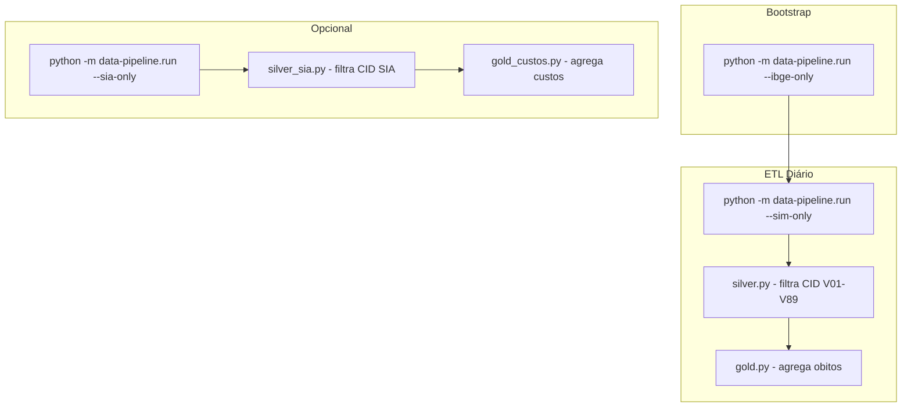

# Pipeline ETL — Proposta de Otimização

> **Proposta de simplificação e otimização do pipeline de ETL**
> Versão: 1.0 — Criado em: 2026-05-09

---

## 1. Diagnóstico do Problema

### 1.1 Tempo de Execução Atual

O pipeline atual (`run.py`) ao executar com dados reais (BA + PB) apresenta os seguintes tempos aproximados:

| Estágio | Tempo Estimado | Problema |
|---------|---------------|----------|
| Download PySUS (SIM + SIA) | 2-5 min | FTP pode ser lento |
| Bronze (Parquet) | 30s-1 min | Leitura .dbc |
| IBGE fetcher (HTTP calls) | 10-15 min | Centenas de chamadas HTTP sequenciais |
| Silver (filtro CID V01-V89) | 1-2 min | Processamento DuckDB |
| Gold (agregações) | 1-2 min | Agregações |
| **Total** | **15-25 min** | — |

### 1.2 Causas Raiz

1. **SIA muito pesado**: milhões de registros vs ~38k do SIM (BA+PB)
2. **IBGE fetcher sequencial**: cada município = 1 HTTP request (5.570 municípios)
3. **Sem cache**: IBGE roda a cada execução mesmo quando dados não mudaram
4. **Sem paralelização**: etapas são executadas sequencialmente

### 1.3 Priorização do SIM

O SIM é suficiente para as principais análises:
- Taxa de mortalidade por 100k habitantes
- Distribuição por faixa etária, sexo, tipo de veículo
- Série temporal mensal
- Cruzamento geográfico (mapa, ranking)

O SIA traz dados de custos ambulatoriais que, embora importantes para o trabalho final, não são necessários para iteração rápida de desenvolvimento.

---

## 2. Proposta de Simplificação

### 2.1 Tornar SIA Opcional

**Mudança**: Adicionar flag `--no-sia` ao orchestrator `run.py`

**Novo fluxo padrão (desenvolvimento):**
```bash
# Rápido: SIM apenas
python -m data-pipeline.run --sim-only --ufs BA --anos 2023

# Completo: SIM + SIA (quando necessário)
python -m data-pipeline.run --ufs BA --anos 2023
```

**Benefícios:**
- Tempo de execução: ~25 min → ~5 min para desenvolvimento
- Iteração rápida: desenvolvedor pode testar alterações em minutos
- SIA executado explicitamente quando necessário (CI/notebook)

**Impacto no sistema:**
- `gold_custos.parquet` deixa de ser gerado quando `--no-sia`
- Endpoints de custos retornam 0 ou dados vazios
- Frontend adapta UI (desabilita métricas de custos)

### 2.2 IBGE Fetcher como Stage Separado

**Mudança**: IBGE fetcher NÃO faz parte do pipeline principal

**Novo fluxo:**
```bash
# 1. Executar uma vez quando precisar de coordenadas/população
python -m data-pipeline.run --ibge-only

# 2. Pipeline diário (sem IBGE)
python -m data-pipeline.run --sim-only --ufs BA --anos 2023
python -m data-pipeline.run --gold

# 3. Opcional: SIA em background
python -m data-pipeline.run --sia-only --ufs BA --anos 2023
```

**Por que dados IBGE mudam raramente:**
- Divisão territorial (códigos/nomes): alterada apenas quando há criação de município
- Coordenadas (lat/lon): não mudam
- População: estimativa anual released uma vez por ano (IBGE Tabela 6579)

**Estratégia de cache:**
- `ibge_municipios.parquet` = atualizado quando IBGE soltar nova divisão
- `ibge_populacao.parquet` = atualizado quando IBGE soltar novas estimativas
- Checksum/timestamp para detectar mudanças

### 2.3 Dependências entre Estágios



**Regra**: `gold_obitos_ocorrencia.parquet` e `gold_obitos_residencia.parquet` são gerados mesmo sem SIA.

---

## 3. Implementação Proposta

### 3.1 Alterações em `run.py`

```python
# Flags a adicionar em run.py

parser.add_argument("--sim-only", action="store_true",
    help="Executa apenas pipeline SIM (sem SIA)")
parser.add_argument("--sia-only", action="store_true",
    help="Executa apenas pipeline SIA")
parser.add_argument("--ibge-only", action="store_true",
    help="Executa apenas IBGE fetcher")
parser.add_argument("--no-sia", action="store_true",
    help="Desabilita processamento SIA")
```

### 3.2 IBGE Fetcher Otimizado

```python
# Proposta: ibge_fetcher.py com cache

from pathlib import Path
import hashlib
import requests

CACHE_DIR = Path("data/ibge_cache")
CACHE_DIR.mkdir(exist_ok=True)

def fetch_municipios_com_cache():
    cache_file = CACHE_DIR / "municipios_v1.parquet"
    if cache_file.exists():
        logger.info("ibge_cache_hit", file=cache_file)
        return cache_file

    # Fetch com rate limiting
    dados = fetch_ibge_com_retry()
    dados.to_parquet(cache_file)
    return cache_file

def fetch_populacao_com_cache(ano: int):
    cache_file = CACHE_DIR / f"populacao_{ano}.parquet"
    if cache_file.exists():
        logger.info("ibge_cache_hit", file=cache_file)
        return cache_file

    dados = fetch_sidra_6579(ano)
    dados.to_parquet(cache_file)
    return cache_file
```

### 3.3 Validação de Dados

Quando SIA é desabilitado:
```python
if no_sia_mode:
    logger.warning("sia_disabled",
        message="Custos ambulatoriais não disponíveis. "
                "Indicadores de custo per capita desabilitados.")
```

---

## 4. Ganhos Estimados

| Métrica | Antes | Depois (SIM-only) | Depois (completo c/ cache) |
|---------|-------|-------------------|----------------------------|
| Tempo pipeline | 15-25 min | 3-5 min | 8-12 min |
| Chamadas HTTP IBGE | ~5570 | 0 (com cache) | 0 (com cache) |
| Memória RAM peak | ~8 GB | ~2 GB | ~6 GB |
| Iterações/dia (dev) | ~10 | ~50 | ~20 |

---

## 5. Compatibilidade com Frontend

| Flag | Impacto no Frontend |
|------|-------------------|
| `--sim-only` | Métricas de custos desabilitadas (gráfico vazio, KPIs = 0) |
| `--no-sia` | Mesmo que `--sim-only` |
| `--ibge-only` | Lat/lon disponíveis para mapa; sem impacto visual |

**Nota**: O frontend já trata casos onde dados estão vazios (loading state, valores "N/D").

---

## 6. Cronograma de Implementação

| Tarefa | Complexidade | Tempo Estimado |
|--------|-------------|----------------|
| Adicionar flags `--sim-only`, `--no-sia` em run.py | Baixa | 1-2 horas |
| Validar pipeline com `--sim-only` | Baixa | 30 min |
| Implementar cache para IBGE fetcher | Média | 2-3 horas |
| Documentar novo fluxo em README.md | Baixa | 30 min |
| Testar com dados reais (BA 2023) | Baixa | 1 hora |

---

## 7. Riscos e Mitigações

| Risco | Probabilidade | Impacto | Mitigação |
|-------|---------------|---------|-----------|
| SIA fica permanentemente desatualizado | Baixa | Médio | Executar `run --sia-only` semanalmente via cron |
| Cache IBGE stale | Baixa | Baixo | Timestamp check + manual refresh |
| Frontend quebra sem dados SIA | Baixa | Alto | UI já trata dados vazios |

---

## 8. Referências

- [`SPEC.md`](SPEC.md) — Visão geral do projeto
- [`ARCHITECTURE.md`](ARCHITECTURE.md) — Arquitetura técnica
- [`BACKLOG_TAREFAS.md`](BACKLOG_TAREFAS.md) — Tarefa 6.1-6.4 relacionado

---

*Última atualização: 2026-05-09*