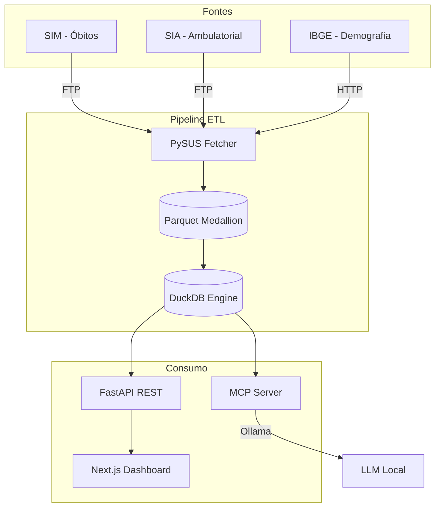

# SPEC — Pipeline Analítico de Acidentes de Trânsito no SUS

> **Documento raiz de especificações (Spec-Driven Development)**
> Versão: 1.0 — Atualizado em: 2026-05-12

---

## 1. Visão do Projeto

Sistema de apoio à decisão que analisa o impacto econômico e as macrotendências de acidentes de trânsito nos dados públicos do Sistema Único de Saúde (SUS) do Brasil.

### Objetivos

1. **Ingerir** microdados de mortalidade (SIM) e custos ambulatoriais (SIA) do DATASUS via PySUS
2. **Transformar** em arquitetura Medallion (Bronze -> Silver -> Gold) com DuckDB + Parquet
3. **Enriquecer** com dados demográficos do IBGE (localidades, coordenadas, população)
4. **Expor** via API REST (FastAPI) para dashboards, mapas e indicadores relativos
5. **Predizer** tendências de 12 meses com o modelo TimesFM (Google Research)
6. **Consultar** via chat com Ollama + MCP tools (linguagem natural -> SQL)

### Fontes de Dados

| Base | Sistema | Órgão | Status | Indicadores |
|------|---------|-------|--------|-------------|
| **SIM** | Sistema de Informações sobre Mortalidade | DATASUS/SVS | ✅ Implementada | Taxa mortalidade 100k, distribuição por faixa/tipo |
| **SIA/PA** | Sistema de Informações Ambulatoriais | DATASUS | ⚠️ Opcional | Custo per capita (temporariamente desabilitado para otimização) |
| **IBGE** | Tabela 6579 SIDRA + API Localidades | IBGE | ⚠️ Parcial | População, coordenadas, malhas |
| **SENATRAN** | Frota de veículos por município | SENATRAN | ⚠️ Parcial (CSV/Parquet local) | Óbitos por 10k veículos com `frota_municipio_ano.parquet` |
| **PRF** | Acidentes nas estradas | PRF | ⏳ Pendente | Cruzamento com SIM |
| **RENAEST** | Rondas integradas | PRF/Estado | ⏳ Pendente | Validação de ocorrências |

---

## 2. Arquitetura Atual



### Stack Tecnológica Atual

| Camada | Tecnologia |
|--------|------------|
| ETL Engine | DuckDB 1.0+ (OLAP in-process) |
| Armazenamento | Apache Parquet (colunar) |
| Backend | FastAPI + Pydantic |
| Frontend | Next.js 16 + Tailwind + Recharts + MapLibre GL JS |
| IA Preditiva | TimesFM (Google Research) |
| IA Conversacional | FastMCP + Ollama |
| Testes | pytest (suite principal; ~64 testes passando localmente) |
| Lint/Format | ruff |

---

## 3. Indicadores Implementados

### 3.1 Taxa de Mortalidade por 100 mil habitantes

```python
taxa_mortalidade = (total_obitos / populacao_estimada) * 100.000
```

- **Fonte numerador**: SIM (CODMUNOCOR ou CODMUNRES)
- **Fonte denominador**: IBGE Tabela 6579 (estimativas anuais)
- **Referência**: DATASUS Ficha C.12

### 3.2 Custo per Capita

```python
custo_per_capita = custo_total_SUS / populacao_estimada
```

- **Fonte numerador**: SIA/PA (`PA_VALAPR` filtrado CID V01-V89)
- **CUIDADO**: `PA_VALAPR` já é o total — não multiplicar por `PA_QTDAPR`
- **Status**: Temporariamente desabilitado para priorizar SIM

### 3.3 Óbitos por 10 mil veículos

```python
taxa_veiculos = (total_obitos / frota_municipio) * 10.000
```

- **Fonte frota**: arquivo normalizado (`data/frota/frota_normalizada_ibge.csv`) → Gold `frota_municipio_ano.parquet` (`--frota` no `run.py`).
- **API**: campos opcionais `frota_total` e `taxa_obitos_por_10mil_veiculos` em `GET /api/indicadores/municipio/{cod}` quando a view DuckDB `v_frota_municipio_ano` está disponível.
- **Granularidade diária**: apenas dimensão **ocorrência** (`GET /api/dashboard/municipio/{cod}/serie-diaria?ano=&dimensao=ocorrencia`).

---

## 4. Status de Implementação por Camada

### 4.1 Pipeline ETL (data-pipeline/)

| Script | Status | Descrição |
|--------|--------|-----------|
| `run.py` | ✅ Implementado | Orquestrador CLI (`--gold`, `--frota`, `--ibge-only`, etc.) |
| `bronze.py` | ✅ Implementado | Ingere .dbc via PySUS -> Parquet |
| `silver.py` | ✅ Implementado | Filtra CID V01-V89, deriva tipo_veiculo/faixa_etaria |
| `gold.py` | ✅ Implementado | Agrega por municipio/mes (ocorrencia + residencia) |
| `gold_timeseries.py` | ✅ Implementado | Serie diaria `eventos_diarios_municipio.parquet` |
| `frota_gold.py` | ✅ Implementado | CSV SENATRAN normalizado → `frota_municipio_ano.parquet` |
| `ibge_fetcher.py` | ⚠️ Parcial | Baixa coordenadas/população, mas faz muitas chamadas HTTP |
| `ibge.py` | ✅ Implementado | Funções auxiliares (get_info, get_populacao) |

### 4.2 Backend API (backend/)

| Endpoint | Status | Filtros |
|---------|--------|--------|
| `GET /api/dashboard/summary` | ✅ | ano, municipio, uf, regiao, tipo_veiculo, dimensao |
| `GET /api/dashboard/municipios` | ✅ | uf, regiao, dimensao |
| `GET /api/dashboard/municipio/{cod}` | ✅ | ano, dimensao |
| `GET /api/dashboard/municipio/{cod}/serie-diaria` | ✅ | `ano` (query), `dimensao` (só ocorrência tem série diária) |
| `GET /api/dashboard/mapa` | ✅ | ano, uf, regiao, dimensao, metrica |
| `GET /api/geo/municipios` | ✅ | ano, uf, regiao, dimensao, metrica |
| `GET /api/indicadores/municipio/{cod}` | ✅ | ano, dimensao; anos com dados via `DISTINCT ano` na view SIM |
| `GET /api/indicadores/ranking` | ✅ | ano, metrica, uf, regiao |

Resposta resumida `GET /api/dashboard/municipio/{cod}/serie-diaria`: `serie_diaria_disponivel`, `pontos` (`data`, `obitos`), `resumo` com `total_obitos_ano`, `dia_pico`, `share_obitos_no_dia_pico`, `alerta_concentracao`, limiares; ou `motivo` quando indisponível (residência ou Parquet ausente).

### 4.3 Frontend (frontend/src/app/)

| Página | Status | Filtros |
|--------|--------|--------|
| `/dashboard` | ✅ | dimensao, regiao, uf, ano, municipio, tipo_veiculo |
| `/municipio` | ✅ | dimensao, regiao, uf, ano, municipio; gráficos anual/mensal/diário, export CSV anual, alerta de concentração |
| `/mapa` | ✅ | dimensao, regiao, uf, ano, metrica |
| `/ranking` | ✅ | metrica, regiao, uf, ano |
| `/previsao` | 🔄 Em desenvolvimento | — |
| `/chat` | 🔄 Em desenvolvimento | — |

---

## 5. Matriz de Capacidades: Existe vs Planejado

| Capacidade | Status | Notas |
|------------|--------|-------|
| Filtro por ano | ✅ | Implementado em todos endpoints |
| Filtro por UF | ✅ | Implementado |
| Filtro por Região | ✅ | Implementado |
| Filtro por Município | ✅ | Implementado |
| Filtro por Tipo Veículo | ✅ | Implementado |
| Filtro por Dimensão (ocorr/resid) | ✅ | Implementado |
| Filtro por Faixa Etária | ⏳ | Existe no schema Silver, não exposto no frontend |
| Filtro por Sexo | ⏳ | Existe no schema Silver, não exposto no frontend |
| Indicador: Mortalidade/100k | ✅ | Implementado |
| Indicador: Custo per capita | ⚠️ | SIA desabilitado temporariamente |
| Indicador: Óbitos/10k veículos | ⚠️ | Requer Gold de frota; API/UI degradam sem Parquet |
| Série diária + alerta de pico (share no dia máximo) | ✅ | `serie-diaria` + página município |
| Mapa com polígonos IBGE | ✅ | GeoJSON com PostGIS future |
| Ranking de municípios | ✅ | Página `/ranking` |
| Previsão TimesFM | 🔄 | Endpoint existe, UI em desenvolvimento |

---

## 6. Dicionário de Dados

Ver [`MODELAGEM_DADOS.md`](MODELAGEM_DADOS.md) para schema completo com status de implementação.

---

## 7. Regras de Negócio

Ver [`FINANCEIRO.md`](FINANCEIRO.md) para metodologia de cálculos financeiros.

Ver [`DADOS_MUNICIPIO.md`](DADOS_MUNICIPIO.md) para semântica de município (ocorrência vs residência).

---

## 8. Problemas Conhecidos (Gap Analysis)

| # | Problema | Impacto | Solução Proposta |
|---|----------|--------|------------------|
| G1 | `lat/lon` null no Gold | Mapa não mostra coordenadas | Executar `ibge_fetcher.py` separadamente |
| G2 | GeoJSON usa código 6d vs 7d | Polígonos mismatched | Fuzzy matching NFKD (99.95% cobertura com SENATRAN) |
| G3 | SIA muito lento (milhões registros) | Bloqueia desenvolvimento | Tornar SIA opcional (`--no-sia`) |
| G4 | IBGE fetcher faz centenas de chamadas HTTP | Pipeline demora 10+ min só em IBGE | Fetch uma vez, cache persistente |
| G5 | SIDRA/API pode variar formato | Break parsing | Verificar após atualização IBGE |

---

## 9. Próximos Passos (Roadmap)

| Fase | Ação | Prioridade |
|------|------|------------|
| 1 | Otimizar ETL: SIA opcional + IBGE cache | 🔴 Alta |
| 2 | Fetcher oficial SENATRAN + harmonização 7d IBGE na frota | 🟡 Média |
| 3 | Migrar para Postgres + PostGIS | 🟡 Média |
| 4 | Integrar PRF (cruzamento validate) | 🟢 Baixa |
| 5 | UI de previsão TimesFM | 🟢 Baixa |

---

## 10. Referências Cruzadas

| Documento | Descrição |
|----------|-----------|
| [`ARCHITECTURE.md`](ARCHITECTURE.md) | Arquitetura técnica e diagramas |
| [`MODELAGEM_DADOS.md`](MODELAGEM_DADOS.md) | Schema completo + gap analysis |
| [`BACKLOG_TAREFAS.md`](BACKLOG_TAREFAS.md) | Iterações e status de tarefas |
| [`PIPELINE_ETL.md`](PIPELINE_ETL.md) | Proposta de otimização do ETL |
| [`adr/ADR-001_ENGINE_CHOICE.md`](adr/ADR-001_ENGINE_CHOICE.md) | Decisão arquitetural: DuckDB vs Postgres |
| [`FINANCEIRO.md`](FINANCEIRO.md) | Metodologia de cálculos financeiros |
| [`DADOS_MUNICIPIO.md`](DADOS_MUNICIPIO.md) | Semântica de município |

---

*Última atualização: 2026-05-12*