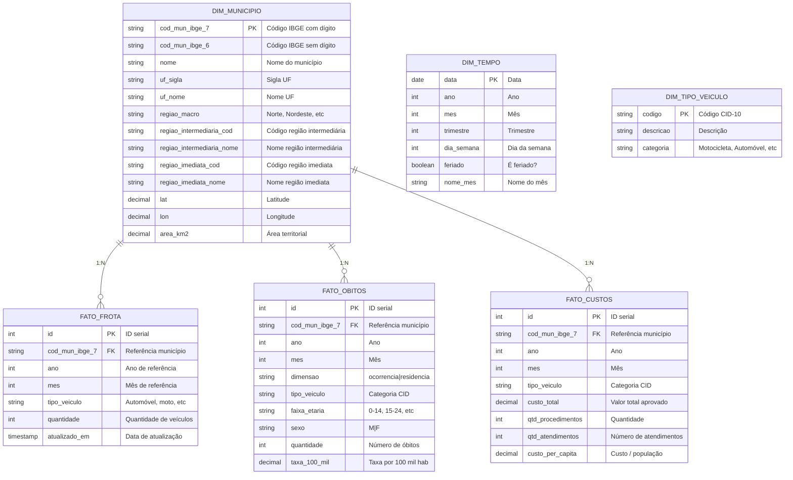

# ADR-002: Modelagem Dimensional com Dados Geográficos Desacoplados

## Status

**Aceito** - 2026-04-05

## Contexto

A modelagem atual possui limitações na estrutura geográfica:

1. **Acoplamento Problemático**: `ibge_fetcher.py` infere municípios a partir dos dados Silver (que têm apenas municípios com eventos de trânsito), não contém todos os 5.570 municípios brasileiros

2. **Dados Geográficos Incompletos**: Se processamos apenas BA, só temos IBGE dos municípios com óbitos na BA

3. **Hierarquia Regional Ausente**: Não temos Regiões Geográficas Intermediárias/Imediatas do IBGE (divisões oficiais de 2017)

4. **Dados Temporais Desnormalizados**: Frota, PIB, população são atributos que mudam no tempo, mas estariam em tabela única

5. **Análise Ocorrência vs Residência**: SIM tem ambos os campos, mas precisamos garantir que ambos estejam disponíveis

## Decisão

Criar uma **base geográfica desacoplada e normalizada**, carregada uma única vez e atualizada periodicamente.

### Princípios

1. **Dimensão Geográfica Completa**: Todos os 5.570 municípios, independente de terem eventos
2. **Normalização Temporal**: Dados históricos (frota, PIB) em tabelas fato separadas
3. **Hierarquia IBGE 2017**: Regiões Intermediárias/Imediatas incluídas
4. **Desacoplamento**: Base geográfica não depende dos dados DATASUS

### Modelo Entidade-Relacionamento



## Fontes de Dados

### 1. DIM_MUNICIPIO

| Campo | Fonte | Periodicidade | URL |
|-------|-------|---------------|-----|
| `cod_mun_ibge_*` | CSV IBGE | Anual (atualização cadastral) | [Códigos Municípios](https://www.ibge.gov.br/explica/codigos-dos-municipios.php) |
| `nome`, `uf_*` | CSV IBGE | Anual | Mesmo acima |
| `regiao_*` | CSV IBGE | Anual | Mesmo acima |
| `lat`, `lon` | API IBGE Localidades | Única vez | `servicodados.ibge.gov.br/api/v1/localidades` |
| `area_km2` | Censo 2022 (Tabela 4714) | Decenal | SIDRA Tabela 4714 |

**Nota**: CSV com 5.570 municípios já obtido em `data/municipios.csv`

### 2. FATO_FROTA

| Campo | Fonte | Periodicidade |
|-------|-------|---------------|
| `quantidade`, `tipo_veiculo` | DENATRAN/RENAVAM | Mensal |

**Fonte**: [Portal de Dados Abertos - RENAVAM](https://dados.transportes.gov.br/dataset/renavam)

### 3. FATO_OBITOS (SIM)

| Campo | Fonte | Periodicidade |
|-------|-------|---------------|
| Todos | DATASUS - SIM | Mensal/Anual |

**Dimensão Ocorrência**: `CODMUNOCOR` (onde o acidente aconteceu)  
**Dimensão Residência**: `CODMUNRES` (onde a vítima morava)

### 4. FATO_CUSTOS (SIA)

| Campo | Fonte | Periodicidade |
|-------|-------|---------------|
| Todos | DATASUS - SIA/PA | Mensal |

**Nota**: SIA tem apenas município do paciente (`PA_MUNPCN` = residência), não do estabelecimento.

## Consequências

### Positivas ✅

1. **Base Geográfica Completa**: Todos os 5.570 municípios disponíveis para lookup
2. **Análises Comparativas**: Podemos calcular taxas para municípios SEM eventos (taxa = 0)
3. **Séries Temporais**: Frota, PIB, população históricos preservados
4. **Hierarquia Regional**: Análises por Região Intermediária/Imediata (fluxos reais de mobilidade)
5. **Flexibilidade**: Novos dados (ex: IDH, PIB) adicionados sem alterar estrutura existente

### Negativas ⚠️

1. **Complexidade de Joins**: Queries precisam JOIN com dimensão geográfica
2. **Storage Adicional**: Tabela de municípios com 5.570 registros (trivial)
3. **Sincronização**: Base geográfica precisa ser atualizada quando IBGE atualizar códigos

## Exemplo de Query

```sql
-- Taxa de mortalidade por frota (indicador mais preciso)
SELECT 
    m.uf_sigla,
    m.nome as municipio,
    o.ano,
    o.dimensao,
    SUM(o.quantidade) as total_obitos,
    SUM(f.quantidade) as total_frota,
    (SUM(o.quantidade)::decimal / NULLIF(SUM(f.quantidade), 0)) * 10000 as taxa_por_10k_veiculos
FROM fato_obitos o
JOIN dim_municipio m ON o.cod_mun_ibge_7 = m.cod_mun_ibge_7
LEFT JOIN fato_frota f ON o.cod_mun_ibge_7 = f.cod_mun_ibge_7 
    AND o.ano = f.ano 
    AND f.tipo_veiculo = 'TOTAL'
WHERE o.ano = 2023
GROUP BY m.uf_sigla, m.nome, o.ano, o.dimensao;

-- Análise por Região Geográfica Intermediária
SELECT 
    m.regiao_intermediaria_nome,
    o.ano,
    o.tipo_veiculo,
    SUM(o.quantidade) as total_obitos,
    SUM(o.quantidade)::decimal / m2.populacao * 100000 as taxa_100_mil_hab
FROM fato_obitos o
JOIN dim_municipio m ON o.cod_mun_ibge_7 = m.cod_mun_ibge_7
JOIN (
    SELECT regiao_intermediaria_cod, SUM(populacao) as populacao
    FROM dim_municipio
    GROUP BY regiao_intermediaria_cod
) m2 ON m.regiao_intermediaria_cod = m2.regiao_intermediaria_cod
WHERE o.dimensao = 'ocorrencia'
GROUP BY m.regiao_intermediaria_nome, o.ano, o.tipo_veiculo, m2.populacao;
```

## Implementação

### Camada Bronze (Parquet)
- Dados brutos SIM/SIA como chegam do DATASUS
- Dados brutos DENATRAN (frota)
- Dados brutos IBGE (CSV + APIs)

### Camada Silver (Parquet)
- SIM: filtrado CID V01-V89, campos normalizados
- SIA: filtrado CID V01-V89, valores corrigidos
- Frota: normalizado por tipo de veículo
- Geografia: CSV + coordenadas + área

### Camada Gold (Parquet + PostgreSQL)
- Tabelas fato agregadas (mês/município)
- Dimensões enriquecidas
- Pronto para consumo

### Sync para PostgreSQL
- `dim_municipio`: INSERT completo (5.570 registros)
- `fato_*`: INSERT por período ou UPSERT

## Referências

- [IBGE - Divisão Territorial](https://www.ibge.gov.br/geociencias/organizacao-do-territorio/estrutura-territorial/15717-divisao-territorial-do-brasil.html)
- [Atlas Brasil - IDH](http://www.atlasbrasil.org.br/)
- [DENATRAN - Frota](https://dados.transportes.gov.br/dataset/renavam)

---

**Autor**: Thallys Lemos  
**Data**: 2026-04-05  
**Depende de**: ADR-001 (Arquitetura PostgreSQL)
