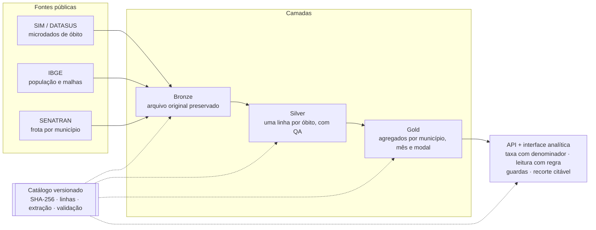

# Página "Sobre o projeto" — especificação

Rota nova `/sobre`, último item do grupo **MÉTODO** no menu. Mockup navegável em
`sobre-mockup.html` (abre offline, alterna tema claro/escuro).

---

## A ideia que organiza a página

A tentação, numa página "sobre", é listar experiências. Isso mostra currículo,
não polivalência. O que mostra polivalência é uma **convergência**:

> Um trabalho sobre **mortalidade no trânsito** registrada no **sistema de
> saúde** é o único assunto em que os dois lados da sua experiência profissional
> respondem à mesma pergunta.

Trânsito e cidades inteligentes vêm da Tivic. Análise de dados de saúde pública
vem do CEPEDI. A mortalidade viária no SIM é literalmente a interseção. A página
inteira é construída sobre essa frase — ela aparece no lede, volta no bloco do
autor e sustenta a seção de competências.

Isso é mais forte que uma lista porque a evidência é o próprio sistema.

---

## Estrutura — seis seções

### Cabeçalho
Kicker mono, título `Um trabalho na interseção de duas trajetórias`, lede
editorial com régua vertical em `--brand`.

**Uma nota que vale ouro na banca:** logo abaixo do lede, um parágrafo curto
declara que *esta é a única página do sistema com texto editorial* — todas as
outras exibem apenas frases geradas, com a regra identificada. Isso transforma
a página "sobre" de exceção em **confirmação da regra**: o sistema sabe a
diferença entre o que ele afirma e o que o autor afirma.

### 01 · De onde veio — três origens
Três cartões lado a lado, cada um com a mesma estrutura: o que foi, e — separado
por régua pontilhada — **"O que isso aportou"**.

| | Origem | O que aportou |
|---|---|---|
| 01 · o domínio | **Tivic**, do P&D à gerência de time de produtos; software web e pipelines de dados em cidades inteligentes e trânsito | Familiaridade com o dado de trânsito; a prática de construir pipeline que aguenta dado público real; a passagem de quem executa para quem decide o que vale construir |
| 02 · o método | **CEPEDI**, residência: arquitetura da aplicação **SASI** e direcionamento técnico do time em análise de dados de saúde pública | A arquitetura em camadas que este sistema usa; o vocabulário dos sistemas de informação em saúde do SUS; a experiência de orientar tecnicamente, que transforma decisão em padrão |
| 03 · a inquietação | Usar o que sabe, onde vive: a Bahia tem o dado público e não tem a análise | A decisão de não fazer mais um dashboard — construir um instrumento que admite o que não sabe e devolve recorte citável |

A coluna "o que aportou" é o que separa esta página de um currículo: cada
experiência é justificada pelo que ela deixou **neste** sistema.

### 02 · Trajetória
Linha do tempo horizontal de quatro marcos, com pontos ligados por régua de 1px.
O último ponto (IFBA · TCC II) é preenchido; os anteriores, vazados.

### 03 · Como funciona — o diagrama
Vista abstrata do fluxo, em SVG inline (não Mermaid — ver §Diagrama abaixo).
Abaixo dele, cinco indicadores lidos ao vivo do catálogo.

### 04 · Autor
Coluna esquerda: foto, nome, cargo, resumo de duas frases, links externos,
formação. Coluna direita, em fundo recuado: o parágrafo da convergência.

### 05 · Competências aplicadas neste trabalho
Seis blocos com etiquetas. O subtítulo é deliberado: *"cada bloco corresponde a
decisões concretas tomadas neste sistema — não a uma lista de tecnologias"*.

Engenharia de dados · Desenvolvimento web · Arquitetura de software · Análise e
estatística · Produto e liderança técnica · Domínio.

### 06 · Créditos e transparência
Referência ABNT do trabalho, instrução de citação (cite o link do recorte, não
o print), fontes e licenças.

---

## Diagrama — por que SVG e não Mermaid

Você pediu algo "parecido com mmd". A aparência é a de um fluxograma Mermaid; a
implementação, não deve ser. Motivos:

- Mermaid renderiza em tempo de execução e adiciona ~500 KB ao bundle para
  desenhar uma figura estática.
- Mermaid não lê variáveis CSS: o diagrama não acompanharia o tema claro/escuro
  sem gambiarra.
- Um SVG inline usa os tokens diretamente (`var(--risk-1)`, `var(--brand)`,
  `var(--hairline)`) e fica coerente com o design system de graça.

O SVG pronto está no mockup, com `viewBox="0 0 1080 300"` e largura fluida.

A fonte Mermaid equivalente fica registrada aqui, para a documentação do repo:

---

## Indicadores ao vivo

Cinco blocos abaixo do diagrama, lidos de `GET /api/sim/metadata` e
`GET /api/sim/summary` no carregamento, com **valor estático de fallback** para
a página nunca quebrar numa demonstração:

| Bloco | Origem | Fallback |
|---|---|---|
| Linhas na camada Silver | catálogo, dataset `sim_silver_nacional_v2` | 20.410.620 |
| Datasets versionados | contagem de `datasets` no catálogo | 10 |
| Período consolidado | `summary.periodo` | 2010–2024 |
| Recorte CID | fixo | V01–V89 |
| Concordância com a ONSV | fixo (é resultado de validação, não de API) | 99,958% |

A versão do catálogo e a data de extração vão no rodapé de proveniência da
página, também do `metadata`.

Isso faz a página "sobre" ser a última prova da tese: até ela cita a origem dos
números.

---

## O que eu preciso de você

No mockup, tudo que falta está marcado com uma etiqueta âmbar. Me mande:

1. **URLs** — LinkedIn e GitHub (procurei e não localizei seu perfil público).
   Lattes, se tiver e quiser incluir.
2. **Períodos** — mês/ano de início e fim de cada etapa: Tivic P&D, Tivic
   gerência de produtos, residência no CEPEDI.
3. **Cargo atual** — encontrei "Analista de Desenvolvimento de Sistemas Pleno"
   numa fonte de terceiros, não confirmada. Confirme ou corrija.
4. **Nome do programa de residência** do CEPEDI (residência em TIC? em
   software?) e o ano.
5. **SASI** — o que a sigla significa e uma linha sobre o que a aplicação faz.
   Vale muito ter isso escrito.
6. **Foto** — retrato quadrado, mínimo 400×400. Se preferir sem foto, o bloco
   funciona com as iniciais em monoespaçada.
7. **Licença** — do código e das figuras (sugestão: MIT no código, CC BY 4.0
   nas figuras).

Sem esses dados a página fica no ar do mesmo jeito: os campos ausentes somem
em vez de mostrar placeholder.

---

## Decisões de design system respeitadas

- **Nenhuma cor de dado nesta página.** Não há valor codificado aqui, então
  `--risk-*` só aparece dentro do diagrama, onde nomeia as camadas. O resto usa
  neutros e `--brand`. É a única tela do sistema assim, e isso é coerente.
- Régua de 1px, raio 6/4, sem sombra — a única sombra permitida seria em
  popover, e não há nenhum.
- Rótulos e números em mono; texto em sans.
- Foto e links são elementos de interface: traço e texto, nunca preenchimento
  colorido.
- Rodapé de proveniência como em toda tela, com a ressalva de texto editorial.
